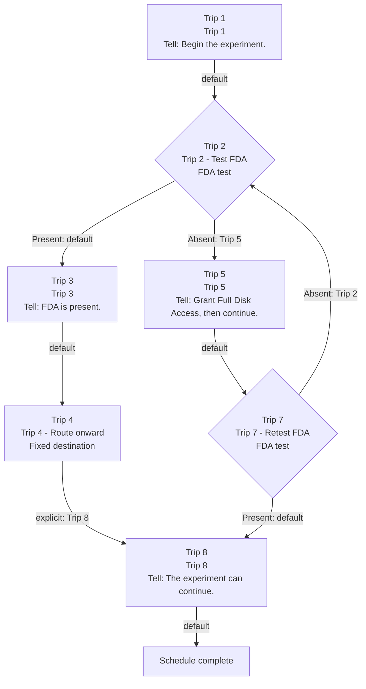

```mermaid
flowchart TD

    T1["Trip 1<br/>Trip 1<br/>Tell: Begin the experiment."]
    T2{"Trip 2<br/>Trip 2 - Test FDA<br/>FDA test"}
    T3["Trip 3<br/>Trip 3<br/>Tell: FDA is present."]
    T4["Trip 4<br/>Trip 4 - Route onward<br/>Fixed destination"]
    T5["Trip 5<br/>Trip 5<br/>Tell: Grant Full Disk Access, then continue."]
    T7{"Trip 7<br/>Trip 7 - Retest FDA<br/>FDA test"}
    T8["Trip 8<br/>Trip 8<br/>Tell: The experiment can continue."]
    Complete["Schedule complete"]

    T1 -->|"default"| T2
    T2 -->|"Present: default"| T3
    T2 -->|"Absent: Trip 5"| T5
    T3 -->|"default"| T4
    T4 -->|"explicit: Trip 8"| T8
    T5 -->|"default"| T7
    T7 -->|"Present: default"| T8
    T7 -->|"Absent: Trip 2"| T2
    T8 -->|"default"| Complete
```
