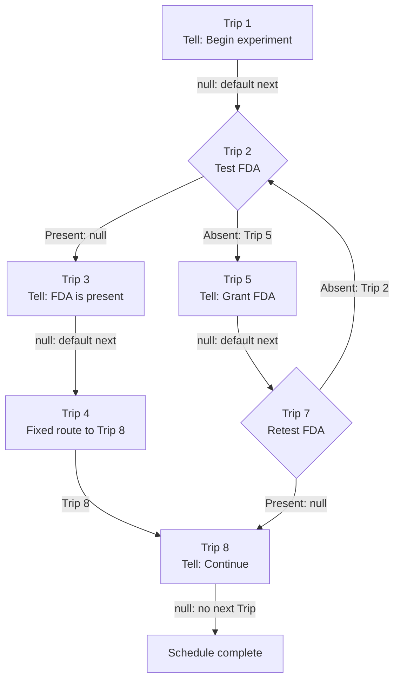

The Schedule is an ordered list of Trips:

```text
1 → 2 → 3 → 4 → 5 → 7 → 8
```

Each Trip currently contains one Step. When that terminal Step completes, it returns either:

- `null`: continue to the next Trip in Schedule order.
- `TripDefinitionId(X)`: jump directly to Trip X.

Crucially, `null` means “default next,” not “stop.”



**Trip By Trip**

| Trip  | Step                                      | Result                                            |
| ----- | ----------------------------------------- | ------------------------------------------------- |
| **1** | Tell the user the experiment is beginning | `null`, so continue to Trip 2                     |
| **2** | Test the fake FDA condition               | Present → `null` → Trip 3; Absent → Trip 5        |
| **3** | Tell the user FDA is present              | `null`, so continue to Trip 4                     |
| **4** | Fixed Destination Step                    | Explicitly jump to Trip 8, skipping Trips 5 and 7 |
| **5** | Tell the user to grant FDA                | `null`, so continue to Trip 7                     |
| **7** | Test FDA again                            | Present → `null` → Trip 8; Absent → Trip 2        |
| **8** | Tell the user the experiment can continue | `null`; no next Trip exists, so complete          |

**Possible Paths**

FDA is already present:

```text
1 → 2 → 3 → 4 → 8 → complete
```

FDA is absent and then granted:

```text
1 → 2 → 5 → 7 → 8 → complete
```

FDA remains absent:

```text
1 → 2 → 5 → 7 → 2 → 5 → 7 → 2 ...
```

The loop is not represented by a special loop object. Trip 7 simply returns the canonical identity of Trip 2 whenever FDA remains absent.

**Who Knows What**

```text
FdaTestStep
    asks the fake authority whether FDA is present
    converts the Boolean into null or TripDefinitionId(X)

Trip
    runs its Steps
    relays only the terminal Step result

Scheduler
    receives null or TripDefinitionId(X)
    resolves the next Trip
```

Neither Trip nor Scheduler knows that FDA was tested or that a Boolean existed.

On restart, only the current Trip is remembered. The Boolean and previous routing decision are not persisted. The current Trip starts again at its first Step.
