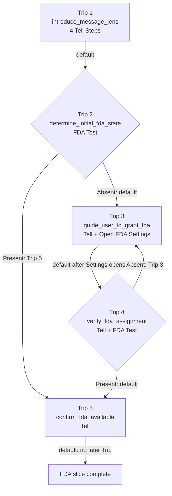

# Real Full Disk Access Onboarding Plan

## Status And Scope

This is an experimental planning document for expressing the real MessageLens
Full Disk Access onboarding story as a Presence Schedule.

It does not authorize production integration. In particular, it does not
change:

- `OnboardingGate`;
- the production Environment Readiness surface;
- the development Presence host;
- archive admission or database access policy;
- FDA permission behavior;
- current restart or preservation behavior.

The plan starts from the implementation that exists today and then proposes
the smallest real FDA Schedule that can be exercised through the established
Presence development tools.

The governing boundaries remain:

```text
Step
    owns workflow meaning and routing configuration

narrow FDA specialist
    owns macOS-specific factual work or Settings-opening work

Trip
    sequences Steps and relays only its terminal result

Scheduler
    resolves null or TripDefinitionId within the active Schedule
```

No generic Agent mechanism isv proposed.

---

## 1. Existing FDA Onboarding Behavior

### Where startup decides setup is required

In the router-backed application, `OnboardingGate.build()` watches
`onboardingEnvironmentReportProvider` and translates the report into an
`OnboardingStatus`.

The relevant path is:

```text
onboardingEnvironmentReportProvider
    -> observes FDA and source readiness

OnboardingGate.build()
    -> permissionBlocked becomes awaitingFda

OnboardingCenterPanelSyncController
    -> installs Environment Readiness ViewSpec

EnvironmentReadinessPanelView
    -> presents the current blocker and actions
```

The debug application currently does not execute this path. In `kDebugMode`,
`App.build()` directly hosts `LinearPresenceExperimentHost`. That is the safe
experimental surface and must remain separate during this work.

### What the current FDA test actually does

The production test is implemented by `MacosFullDiskAccess` behind the
onboarding-owned `FullDiskAccess` interface.

```text
MacosFullDiskAccess.canReadMessagesDatabase()
    -> locate ~/Library/Messages/chat.db
    -> require the file to exist
    -> open it for reading
    -> close it
    -> true on success, false on absence or failure
```

`onboardingFullDiskAccessProvider` exposes that result. The broader environment
report also probes the Messages database and treats either missing FDA or an
unreadable Messages source as the `permissionBlocked` state with the
`fullDiskAccessMissing` blocker.

The factual test is therefore not a general inspection of macOS privacy
configuration. It asks the operational question MessageLens actually cares
about:

> Can this process read the protected Messages database now?

### What currently explains FDA

The effective initial setup UI is the Environment Readiness center panel. For
the FDA blocker it currently says, in substance:

- MessageLens needs permission to read Messages and Contacts databases;
- MessageLens cannot modify Apple's databases;
- the data remains on the Mac;
- open System Settings;
- add or enable MessageLens under Full Disk Access;
- quit and reopen when macOS asks;
- re-check the environment.

An older `_FdaContent` presentation still exists inside `OnboardingOverlay`,
but the shell does not show the blocking overlay for `awaitingFda`. The current
initial FDA experience is the Environment Readiness `ViewSpec`, not that older
overlay.

### What opens System Settings

The action path is:

```text
EnvironmentReadinessPanelView
    -> EnvironmentReadinessActions.openFdaSettings()
    -> OnboardingGate.openFdaSettings()
    -> FullDiskAccess.openSettings()
    -> MacosFullDiskAccess.openSettings()
```

The concrete implementation invokes:

```text
open x-apple.systempreferences:com.apple.preference.security?Privacy_AllFiles
```

This opens the macOS Full Disk Access pane. It does not grant permission.

### What happens while FDA remains absent

The user remains in the FDA-blocked readiness state. Choosing **Re-check**
invalidates the FDA and environment-report providers and causes the gate to
classify the current facts again.

If the Messages database is still unreadable, the same blocker remains active.
There is no attempt counter, retry state, or separate remediation object.

### What happens when FDA becomes available

On re-check or application relaunch, the production readiness facts are
rebuilt. If protected data is now readable, FDA stops being the active
blocker. The readiness panel advances to the next actual concern, such as
Messages availability, Contacts availability, or import readiness.

### Restart and retry behavior that exists today

MessageLens does not currently quit or relaunch itself. Its copy tells the user
that macOS will ask them to quit and reopen the app. macOS owns that prompt and
the user performs the restart.

There is an explicit **Re-check** action for the case where the app remains
open or the user returns without restarting. There is no persisted
"restart required" state.

---

## 2. Plain-English Desired User Journey

### Before the first FDA check

The experimental Schedule presents the four already-approved onboarding
thoughts, one at a time:

1. Welcome to MessageLens.
2. Before getting started, MessageLens needs to make sure it can access the
   local databases containing Messages and Contacts information.
3. Apple calls this permission Full Disk Access; the existing explanation and
   Apple quotation clarify what that means.
4. MessageLens needs the access to read `chat.db` and the Address Book data
   used to associate messages with people.

These thoughts establish trust before MessageLens performs the first visible
FDA check.

### When FDA is already present

MessageLens checks actual readability. If access is available, the user sees a
short confirmation that the required protected data is accessible. The FDA
slice then completes and is ready to hand off to the next onboarding concern.

The user never sees remediation instructions.

### When FDA is absent

MessageLens explains exactly what the user must do, then offers a purposeful
**Open System Settings** action.

The action opens the Full Disk Access pane. Before control leaves the current
workflow, the Schedule advances durably to the verification Trip. This is the
important restart boundary.

### Immediately before restart

The last completed workflow action is:

> Open the correct System Settings pane so the user can add or enable
> MessageLens.

After that action succeeds, the durable Schedule checkpoint is the
verification Trip. MessageLens itself does not claim that permission was
granted and does not issue a quit command.

### After restart when FDA is present

The Schedule resumes at the verification Trip from Step 1. The first text
should be suitable both after a macOS-mandated restart and after an ordinary
return from System Settings. Suggested intent:

> Welcome back. I'll check whether MessageLens can now read the protected
> Messages database.

The factual FDA Step then asks the real specialist. A present result routes to
the confirmation Trip, and the remediation path ends naturally.

### After restart when FDA is still absent

The same verification Trip restarts from Step 1 and performs a fresh factual
test. An absent result routes back to the guidance Trip.

The user receives the instructions again because they remain true, not because
a retry counter requested them. The loop is:

```text
guide the user
    -> open Settings
    -> verify actual readability
    -> still absent
    -> guide the user again
```

The wording must remain patient when repeated. Repetition should not sound
like blame or an error.

---

## 3. Proposed Trip Decomposition

The proposed Schedule uses five semantic Trips.

### Trip 1: `introduce_message_lens`

**Purpose:** Establish what MessageLens needs and why before checking access.

**Ordered Steps:**

1. Tell: `Welcome to MessageLens.`
2. Tell: explain the need to inspect local Messages and Contacts databases.
3. Tell: explain Full Disk Access and preserve the approved Apple quotation.
4. Tell: explain the specific use of `chat.db` and Address Book data.

**Terminal Step:** Fourth `TellStep`.

**Terminal result:** `null`.

**Default next:** `determine_initial_fda_state`.

**Explicit alternate destinations:** None.

**Restart suitability:** An unexpected restart repeats the introduction from
its first thought. That is somewhat repetitive but coherent. It does not
justify current-Step persistence or four one-screen Trips.

### Trip 2: `determine_initial_fda_state`

**Purpose:** Ask the real FDA specialist whether protected Messages data is
currently readable.

**Ordered Steps:**

1. FDA test.

**Terminal Step:** `FdaTestStep`.

**Terminal results:**

```text
present -> TripDefinitionId(confirm_fda_available)
absent  -> null
```

**Default next:** `guide_user_to_grant_fda`.

**Explicit alternate destination:** `confirm_fda_available` when present.

**Restart suitability:** Repeating a factual test is truthful and harmless.

### Trip 3: `guide_user_to_grant_fda`

**Purpose:** Explain the concrete macOS action and take the user to the correct
System Settings pane.

**Ordered Steps:**

1. Tell: explain how to add or enable MessageLens and that macOS may ask the
   user to quit and reopen it.
2. Open Full Disk Access Settings.

**Terminal Step:** Proposed `OpenFdaSettingsStep`.

**Terminal result:** `null` after the Settings-opening request succeeds.

**Default next:** `verify_fda_assignment`.

**Explicit alternate destinations:** None.

**Restart suitability:** If the app stops before the terminal action
completes, the guidance repeats. If the terminal action completes, the
Schedule checkpoints the verification Trip before any later restart. Both
states are understandable.

### Trip 4: `verify_fda_assignment`

**Purpose:** Re-orient the returning user and test the actual changed system
state.

**Ordered Steps:**

1. Tell: calm return/re-check orientation.
2. FDA test.

**Terminal Step:** `FdaTestStep`.

**Terminal results:**

```text
present -> null
absent  -> TripDefinitionId(guide_user_to_grant_fda)
```

**Default next:** `confirm_fda_available`.

**Explicit alternate destination:** `guide_user_to_grant_fda` when absent.

**Restart suitability:** This Trip is deliberately designed as the restart
checkpoint. Starting again with the orientation sentence and a fresh FDA test
is correct whether the previous process was terminated by macOS, closed by the
user, or interrupted unexpectedly.

### Trip 5: `confirm_fda_available`

**Purpose:** Tell the user that the required protected source is now readable
and close the FDA concern.

**Ordered Steps:**

1. Tell: confirm that access is available and setup can continue.

**Terminal Step:** `TellStep`.

**Terminal result:** `null`.

**Default next:** Schedule completion for this bounded experiment. In the
eventual complete onboarding Schedule, the next greater occurrence would be
the next onboarding concern.

**Explicit alternate destinations:** None.

**Restart suitability:** Repeating a successful confirmation is harmless.

---

## 4. Proposed Step Composition

| Trip                          | Position | Step                  | Completion meaning                                                      |
| ----------------------------- | -------: | --------------------- | ----------------------------------------------------------------------- |
| `introduce_message_lens`      |        0 | `TellStep`            | Welcome thought presented                                               |
|                               |        1 | `TellStep`            | Access need explained                                                   |
|                               |        2 | `TellStep`            | FDA and Apple explanation presented                                     |
|                               |        3 | `TellStep`            | Specific database use explained; default next                           |
| `determine_initial_fda_state` |        0 | `FdaTestStep`         | Real readability converted to confirmation or default remediation route |
| `guide_user_to_grant_fda`     |        0 | `TellStep`            | Instructions presented                                                  |
|                               |        1 | `OpenFdaSettingsStep` | Settings-opening request succeeded; checkpoint verification Trip        |
| `verify_fda_assignment`       |        0 | `TellStep`            | Returning user oriented                                                 |
|                               |        1 | `FdaTestStep`         | Fresh readability converted to confirmation or guidance route           |
| `confirm_fda_available`       |        0 | `TellStep`            | FDA slice confirmed and completed                                       |

The Schedule contains no special restart Step. Restart is an external macOS
event. The Schedule's responsibility is to checkpoint a Trip whose first Step
makes sense when the process returns.

---

## 5. Existing Steps That Can Be Reused

### `TellStep`

`TellStep` already owns configured text and returns `null`. It can represent:

- the approved onboarding introduction;
- FDA guidance;
- return orientation;
- success confirmation.

No new prose Step is justified.

### `FdaTestStep`

`FdaTestStep` already:

- asks one narrow `FdaTestingAuthority` for the current fact;
- keeps the Boolean result private;
- converts it to a configured `TripDefinitionId?`;
- exposes no FDA knowledge to Trip or Scheduler.

It can express both the initial test and post-Settings verification without
schema or routing changes.

### `FixedDestinationStep`

The proposed five-Trip ordering does not need a Fixed Destination Step. The
initial present path and verification-absent path are already explicit arms of
the two FDA Steps.

`FixedDestinationStep` remains available, but adding one merely to resemble
the synthetic experiment would add an unnecessary Trip and route.

---

## 6. New Step Types Genuinely Required

### `OpenFdaSettingsStep`

This is the only new concrete Step type currently earned by the real story.

**Exact job:**

> In response to the user's explicit action, ask a narrow FDA Settings
> specialist to open the macOS Full Disk Access pane.

**Persisted definition data:**

The Step needs its ordinary base Step identity and subtype identity. It does
not currently need a persisted URL, pane identifier, arbitrary command, or
destination. Those are implementation knowledge of the narrow macOS
specialist, and ordinary default-next routing leads to verification.

A subtype table containing only `step_definition_id` is sufficient if the
existing table-per-subclass rule remains uniform.

**Side effect/dependency:**

```text
FdaSettingsOpeningAuthority.openSettings()
```

The concrete implementation can delegate to the existing
`FullDiskAccess.openSettings()` behavior from the experimental client boundary.
Presence itself must not import onboarding.

**Trip result:** `null` after the open request completes successfully.

If the specialist reports failure, Step completion fails and the Trip remains
the durable checkpoint. The current experiment does not need a persisted retry
or failure framework to preserve that truthful behavior.

### Capabilities that do not yet justify new Step types

**Continue/Next:** The development host already lets the user deliberately
complete the current Step. The real experiment should first use that proven
manual mechanism. A persisted generic Continue Step is not yet earned.

**Wait or acknowledge:** The verification Trip is the durable waiting point.
It does not need a stored waiting token.

**Restart:** MessageLens does not currently restart itself. macOS and the user
own that action. A Restart Step would falsely claim operational authority the
app does not have.

**Generic action:** Opening one known privacy pane does not justify an
arbitrary-command Step.

One presentation question remains: in a future non-laboratory renderer, the
FDA test must not fire so quickly after opening Settings that the user has had
no chance to act. For this experiment, manual Step-by-Step execution supplies
the deliberate re-check boundary. Whether production `FdaTestStep`
presentation is user-triggered or app-lifecycle-triggered must be decided
before production integration; it does not require a new routing mechanism.

---

## 7. FDA Execution/Agent Boundary

### 1. What code currently knows how to test FDA?

`MacosFullDiskAccess.canReadMessagesDatabase()` knows how to test the real
condition. It checks whether `~/Library/Messages/chat.db` exists and can be
opened for reading.

The production `FullDiskAccess` interface owns two narrow operations:

```text
canReadMessagesDatabase()
openSettings()
```

The environment report consumes the first. Onboarding actions consume the
second.

### 2. Can the factual logic sit behind `FdaTestingAuthority`?

Yes. The existing Presence boundary is:

```text
FdaTestingAuthority.hasFullDiskAccess() -> Future<bool>
```

An adapter in the experimental client can implement that contract by
delegating to the real `FullDiskAccess.canReadMessagesDatabase()` result. The
adapter, not Presence, is where the onboarding-owned implementation and the
Presence-owned contract meet.

### 3. Is `FdaTestingAuthority` already effectively the first Agent contract?

Functionally, yes. It has the important property intended by the Agent idea:

```text
FdaTestStep
    owns the workflow question and routing arms

FdaTestingAuthority
    owns how the external fact is obtained
```

Calling it an Agent adds no capability today. Its present name accurately
describes the narrow authority it grants.

### 4. What would a general Agent concept add now?

It might provide common lookup, lifecycle, or dispatch machinery. None of that
is required by this Schedule. Introducing it now would add indirection while
making the concrete FDA dependency harder to inspect.

The likely losses would be:

- weaker compile-time clarity;
- a persisted identifier whose stability rules are not known;
- registry failure modes;
- pressure toward generic parameter and result bags;
- less obvious ownership of macOS-specific behavior.

### 5. What evidence would justify a persisted Agent identity later?

Reconsider only after real Steps repeatedly need all of the following:

- definitions must select among interchangeable specialists at runtime;
- that selection must survive process restart as definition data;
- several Step types share the same stable specialist identity;
- concrete constructor injection has become genuine duplicated machinery;
- specialist availability and version compatibility have explicit semantics.

One FDA test and one FDA Settings action do not provide that evidence.

### Smallest concrete boundary

For this experiment:

```text
FdaTestStep
    -> FdaTestingAuthority
        -> experimental adapter
            -> existing real FullDiskAccess.canReadMessagesDatabase()

OpenFdaSettingsStep
    -> FdaSettingsOpeningAuthority
        -> experimental adapter
            -> existing real FullDiskAccess.openSettings()
```

The two contracts may be implemented by one adapter object, but they remain
narrow capabilities. No base Agent type, registry, or persisted Agent ID is
needed.

---

## 8. Restart And Resume Experience

The decisive placement is the boundary between guidance and verification.

```text
guide_user_to_grant_fda
    Tell instructions
    OpenFdaSettingsStep
        -> successful completion
        -> repository checkpoints verify_fda_assignment

macOS may then terminate MessageLens

next launch
    ScheduleRun.currentTripOccurrenceId
        -> verify_fda_assignment
        -> Trip begins again at Step 1
```

The verification Trip starts with orientation rather than immediately showing
a raw condition result. That makes at-least-once Trip execution understandable.

If FDA is now present:

```text
verify orientation
    -> real FDA test = present
    -> default next
    -> confirm_fda_available
    -> complete FDA slice
```

If FDA is still absent:

```text
verify orientation
    -> real FDA test = absent
    -> explicit guide_user_to_grant_fda
    -> instructions and Settings action repeat
```

No prior Boolean or route result must survive restart. The next factual test
observes the current system directly.

If the user quits before completing `OpenFdaSettingsStep`, the durable
checkpoint remains the guidance Trip and its instructions repeat. If the user
quits after it completes, the checkpoint is verification. That distinction is
mechanical and requires no restart flag.

---

## 9. Proposed Generated Topology

The topology below follows directly from the proposed ordered Trip definitions
and the two terminal FDA routing configurations.



Expected paths are:

```text
FDA already present
    1 -> 2 -> 5 -> complete

FDA absent, then granted
    1 -> 2 -> 3 -> 4 -> 5 -> complete

FDA remains absent
    1 -> 2 -> 3 -> 4 -> 3 -> 4 -> ...
```

The loop is composed entirely from ordinary Trip entries and canonical routing.

---

## 10. Manual Test Matrix

The experiment must use the development Presence host and existing observability
tools. It must not replace production startup.

Before using a real FDA toggle, verify which macOS Full Disk Access entry and
code identity apply to the debug build. Do not accidentally revoke the shipped
production app's grant merely to test this experiment.

### Scenario A: FDA already present

1. Confirm the test app can read the protected Messages database.
2. Start a fresh experimental Schedule run.
3. Advance through the introduction.
4. Complete the initial FDA test.
5. Verify the path is `1 -> 2 -> 5`.
6. Verify no guidance or Settings-opening Step is visited.
7. Confirm the run completes after the FDA confirmation.

### Scenario B: FDA absent, then granted with restart

1. Start from a safely isolated debug identity with FDA absent.
2. Start a fresh Schedule run.
3. Advance through the introduction and initial test.
4. Verify the run routes to the guidance Trip.
5. Invoke the Open Settings Step.
6. Verify `currentTripOccurrenceId` now identifies the verification Trip.
7. Enable FDA and accept macOS's quit/reopen behavior.
8. Relaunch MessageLens.
9. Verify the run identity is unchanged.
10. Verify the current Trip is verification and it begins at Step 1.
11. Verify the first visible text is the return/re-check orientation.
12. Complete the real FDA test.
13. Verify it observes present access and routes to confirmation.
14. Inspect trace ordering and live map for `1 -> 2 -> 3 -> 4 -> 5`.

### Scenario C: FDA remains absent across restart

1. Follow Scenario B through the Open Settings Step.
2. Do not enable FDA.
3. Restart the app.
4. Verify the run resumes at verification Step 1.
5. Complete the real FDA test.
6. Verify the path returns to guidance.
7. Confirm the repeated wording remains understandable.
8. Repeat once more and verify ordinary trace visits show
   `3 -> 4 -> 3 -> 4`, with no loop-specific event.

### Scenario D: return without restart

1. Route to guidance while FDA is absent.
2. Open System Settings but leave MessageLens running.
3. Return to MessageLens.
4. Deliberately complete the verification Steps in the manual host.
5. Confirm that absent remains in the guidance loop and present escapes it.

### Scenario E: Settings-opening failure

1. Substitute a test authority whose `openSettings()` fails.
2. Invoke the Open Settings Step.
3. Verify the Step does not complete.
4. Verify the durable checkpoint remains the guidance Trip.
5. Verify no route decision or verification checkpoint is recorded.

For every scenario, inspect:

- generated Mermaid topology before execution;
- live Schedule map during execution;
- append-only trace after each Trip boundary;
- `ScheduleRun.currentTripOccurrenceId` before and after restart;
- the exact first text displayed by a reconstructed Trip.

---

## 11. Risks / Awkward Points

### Debug and production FDA identity may not be isolated

The most immediate operational risk is testing by revoking the wrong macOS
privacy grant. The test identity and System Settings entry must be understood
before the real restart experiment begins.

### System Settings returns before the user has acted

The `open` process can complete as soon as the pane is opened. That is enough
to checkpoint the verification Trip, but not evidence that FDA was granted.
This is intentional: only the later `FdaTestStep` may establish that fact.

The manual host provides a deliberate pause before testing. Production
presentation will need an equally truthful trigger.

### The current FDA proxy is Messages readability

The real test proves that `chat.db` is readable. It does not independently
prove every Contacts access path. Contacts readiness is already a separate
onboarding concern and should remain separate.

### The introduction repeats after an unexpected interruption

Because checkpoints are Trip-level, an interruption during the four-Tell
introduction repeats all four thoughts. This is acceptable for the first real
slice. If real use proves it intolerable, first reconsider the Trip boundary;
do not immediately add current-Step persistence.

### Copy after unsuccessful verification matters

The guidance Trip may be revisited many times. Its copy must not imply that
the user failed, that MessageLens remembered an attempt, or that another
restart will certainly solve the issue.

### The FDA slice has an artificial endpoint

`confirm_fda_available` completes the bounded experiment. Real onboarding
would continue to Messages availability, Contacts availability, and import
readiness. The experiment must not pretend that FDA completes onboarding.

---

## 12. Questions That Must Be Answered Before Implementation

1. Which app identity and System Settings entry can safely be used for the real
   FDA-disabled restart experiment without disturbing production MessageLens?
2. Should the experimental real FDA adapter consume the existing onboarding
   `FullDiskAccess` implementation directly, or should the client construct the
   same macOS implementation without importing the onboarding provider seam?
3. What exact text should begin `verify_fda_assignment` so it reads naturally
   both after restart and after an ordinary return from System Settings?
4. In the eventual production renderer, what user or app-lifecycle event
   requests completion of the verification `FdaTestStep`?
5. Is successful invocation of the `open` command the correct completion point
   for `OpenFdaSettingsStep`? The proposed answer is yes, because it proves only
   that MessageLens requested the pane, not that permission changed.
6. Should failure to open System Settings remain an ordinary surfaced Step
   error for this experiment? No persisted failure model is currently earned.
7. What exact confirmation text should close the FDA slice without implying
   that all onboarding readiness checks are complete?
8. When the next real onboarding concern is appended, does the confirmation
   remain its own Trip or become the opening Step of the next semantic chunk?

None of these questions requires a generic Agent registry, new routing model,
or current-Step persistence.

---

## What Can Be Implemented Without Changing Presence Architecture

The following fit the current model:

- a real experimental Schedule fixture with the five Trips above;
- reuse of `TellStep` and `FdaTestStep`;
- one concrete `OpenFdaSettingsStep` subtype;
- one narrow Settings-opening authority;
- a development-client adapter from the existing real FDA implementation to
  `FdaTestingAuthority` and the Settings-opening authority;
- subtype persistence and repository reconstruction for the new concrete Step;
- generated Mermaid topology;
- live map and trace observation;
- manual Step-by-Step execution;
- restart at the verification Trip through the existing Trip-level checkpoint.

These are ordinary additions within established ownership:

```text
concrete Step
    -> concrete narrow authority

Trip
    -> unchanged

Scheduler
    -> unchanged

ScheduleRun checkpoint
    -> unchanged
```

## What, If Anything, Would Require An Architectural Decision

No Presence architecture change is currently required to model or execute the
proposed FDA slice.

A decision would be required only if implementation proves a concrete need
for something outside the current contracts, such as:

- durable progress within a Trip rather than restart from Step 1;
- an app-owned restart operation rather than macOS/user-owned restart;
- a persisted choice among interchangeable FDA specialists;
- execution that must proceed automatically on foreground return without any
  explicit presentation or lifecycle trigger;
- a failure state that must survive restart independently of the Trip
  checkpoint.

Those needs have not been demonstrated. The first implementation should
therefore remain a simple real Schedule plus one specialized Settings-opening
Step and two narrow FDA execution authorities.
