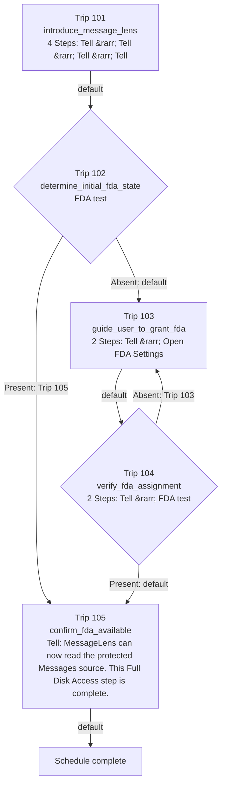

# real_fda_onboarding_experiment

> GENERATED FROM PRESENCE DEFINITIONS  
> DO NOT EDIT AS ROUTING AUTHORITY

Schedule identity: `4`

Batting order: `101 -> 102 -> 103 -> 104 -> 105`

## Topology Facts

- Trips: 5
- Default edges: 5
- Explicit edges: 2
- Conditional alternatives: 4
- Backward edges: 1
- Self-destinations: 0

## Generated Mermaid

