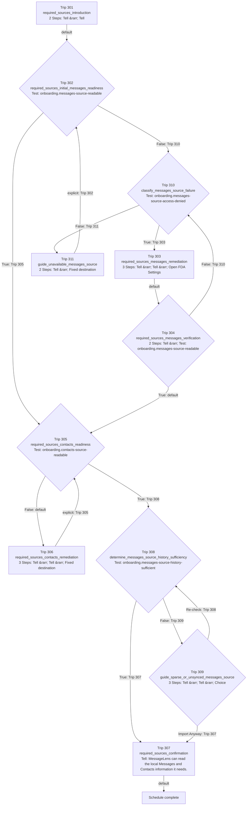

# required_sources_readiness_onboarding_experiment

> GENERATED FROM PRESENCE DEFINITIONS  
> DO NOT EDIT AS ROUTING AUTHORITY

Schedule identity: `6`

Batting order: `301 -> 302 -> 303 -> 304 -> 305 -> 306 -> 308 -> 309 -> 310 -> 311 -> 307`

## Topology Facts

- Trips: 11
- Default edges: 5
- Explicit edges: 12
- Conditional alternatives: 12
- Backward edges: 4
- Self-destinations: 0

## Generated Mermaid

