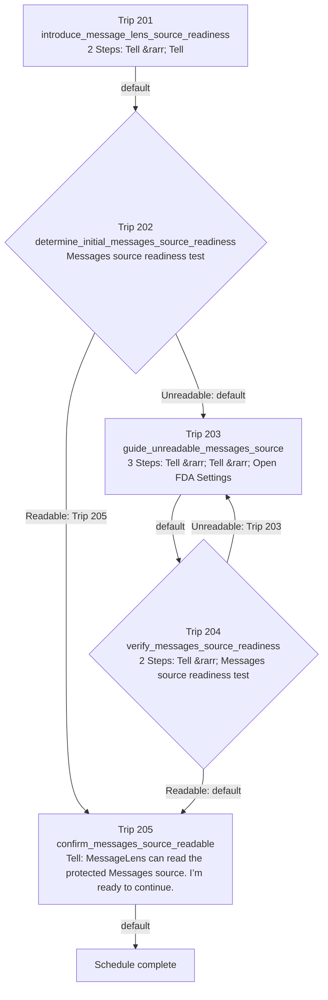

# truthful_messages_source_readiness_onboarding_experiment

> GENERATED FROM PRESENCE DEFINITIONS  
> DO NOT EDIT AS ROUTING AUTHORITY

Schedule identity: `5`

Batting order: `201 -> 202 -> 203 -> 204 -> 205`

## Topology Facts

- Trips: 5
- Default edges: 5
- Explicit edges: 2
- Conditional alternatives: 4
- Backward edges: 1
- Self-destinations: 0

## Generated Mermaid

