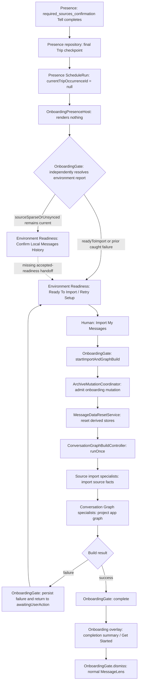

# Post-Readiness Onboarding Handoff Audit

## Conclusion

> **The next real onboarding concern after required-source readiness is the
> truthful handoff from accepted source readiness to the human decision to
> begin initial derived-data construction, and the smallest correct Presence
> treatment is to make the completed required-sources Schedule the durable
> acceptance authority that exposes the existing import-readiness action.**

That handoff does not exist today. Presence completion does not notify,
advance, or resume `OnboardingGate`. The Gate remains independently active and
the Presence surface merely stops covering the center panel that the Gate has
already selected.

This distinction exposes one concrete defect. When the user selects the
persisted `import_anyway` option, the resulting Presence route reaches a
durable completed-Schedule checkpoint, but `OnboardingEnvironmentReport` still
classifies the source as `sourceSparseOrUnsynced`. The underlying
environment-readiness panel
therefore returns to **Confirm Local Messages History**, where only **Re-check**
is available. The durable Presence acceptance has no effect on the legacy
Gate/panel path, so the accepted route does not reach **Import My Messages**.

The next slice should repair that boundary before moving the import operation
itself into Presence or inventing a generic operation Step.

## 1. Exact Current Handoff

### Presence completion authority

The final required-source Trip is
`required_sources_confirmation`. It contains one `TellStep`,
`confirm_required_sources_readable`.

When that Tell finishes:

1. `PresenceRunner._completeCurrentStep()` calls
   `PresenceScheduler.completeCurrentStep()`.
2. `PresenceScheduler` records the Step start and completion.
3. The Trip reports completion.
4. `PresenceScheduler` asks `PresenceScheduleRepository` to checkpoint the Trip
   completion.
5. Because no later occurrence exists, the returned `ScheduleRun` has
   `currentTripOccurrenceId == null`.
6. `PresenceScheduler.isComplete` therefore becomes `true`.
7. `PresenceRunner._executionChanged()` invokes `onScheduleCompleted`.
8. `OnboardingPresenceSurface._scheduleCompleted()` records only local
   presentation state and renders `SizedBox.shrink()`.
9. A later rebuild of `OnboardingPresenceHost` also renders
   `SizedBox.shrink()` directly when its loaded Scheduler is complete.

The durable completion authority is the Presence run checkpoint in
`presence.db`. `_isComplete` in `OnboardingPresenceSurface` is only a local
rendering convenience.

### What `OnboardingGate` observes

`OnboardingGate` observes **nothing** about that completion.

It watches `onboardingEnvironmentReportProvider`, not the Presence Scheduler or
Schedule run. There is no completion event, accepted-readiness value, callback,
provider invalidation, or Gate transition connecting these two authorities.

The phrase “OnboardingGate resumes control” is therefore only a visual
description. The Gate never stopped running. While Presence covered the app,
the Gate normally remained `OnboardingStatus.awaitingUserAction`.

This parallel lifecycle is observable in recovery as well: Gate evaluation may
start automatic derived-data recovery while the required-sources Schedule is
still incomplete. The recovery overlay temporarily replaces Presence, and the
same persisted Presence Trip resumes when Gate returns to
`awaitingUserAction`.

### What replaces the Presence surface

`MacosAppShell` mounts `OnboardingPresenceHost` whenever Gate state is
`awaitingFda` or `awaitingUserAction`. At the same time,
`OnboardingCenterPanelSyncObserver` asks
`OnboardingCenterPanelSyncController` to install
`ViewSpec.environmentReadiness(EnvironmentReadinessSpec.readinessPanel())` for
those same Gate states.

The resulting sequence is:

```text
Gate = awaitingUserAction
    -> readiness ViewSpec is already active in the center panel
    -> Presence host covers it while the Schedule is incomplete
    -> Schedule completes
    -> Presence host renders nothing
    -> the pre-existing readiness ViewSpec becomes visible
```

No new production state replaces Presence at completion. The previously
selected readiness panel is merely revealed.

### What executes immediately afterward

No import code executes immediately afterward.

For the ordinary `readyToImport` report, the revealed panel selects its
`importReadiness` detail and presents **Ready To Import**, **Import My
Messages**, and **Re-check**. Only a human press on **Import My Messages** calls:

```text
EnvironmentReadinessActions.startImportAndGraphBuild()
    -> OnboardingGate.startImportAndGraphBuild()
```

For a still-sparse report, the panel instead selects `messagesDatabase`, shows
**Confirm Local Messages History**, and exposes only **Re-check**. This is where
the accepted `import_anyway` route is currently lost.

## 2. Ordered Post-Readiness Phase Inventory

The actual first-run path is conditional. `OnboardingEnvironmentReport`
continues to classify the world while Presence runs, and the Gate may already
be in recovery or may decide onboarding is unnecessary. For a Schedule that
completes while the Gate remains `awaitingUserAction`, the remaining phases are:

| Order | Current production phase | Category | Current owner |
| --- | --- | --- | --- |
| 1 | Reveal the environment-readiness panel selected from the current report | INFORM / FACT projection | Environment Readiness presentation over Onboarding facts |
| 2 | Ask the human to start or retry initial setup, or to re-check | CHOICE-like command surface | Environment Readiness presentation delegates to `OnboardingGate` |
| 3 | Re-check Full Disk Access immediately before mutation | FACT | `OnboardingGate` through `onboardingFullDiskAccessProvider` |
| 4 | Acquire admitted archive-mutation authority | FACT / OPERATION admission | `ArchiveMutationCoordinator` |
| 5 | Delete/reset active derived import and graph databases | OPERATION | `MessageDataResetService` |
| 6 | Emit `OnboardingStatus.importing` for one rendered frame | WAIT / PROGRESS presentation state | `OnboardingGate` |
| 7 | Emit `OnboardingStatus.buildingGraph` and run the source-scoped graph build | OPERATION / WAIT | Gate coordinates; Conversation Graph and source-import specialists execute |
| 8a | Persist a caught graph-build failure and return to `awaitingUserAction` | RECOVERY | Gate plus `OnboardingFailureStore` |
| 8b | Clear prior graph failure and set `OnboardingStatus.complete` | COMPLETION preparation | `OnboardingGate` |
| 9 | Show the completion summary and require **Get Started** | INFORM / COMPLETION | legacy Onboarding overlay |
| 10 | `OnboardingGate.dismiss()` clears its override, switches to Messages, and sets `notNeeded` | COMPLETION | `OnboardingGate` |
| 11 | Ordinary MessageLens use; live graph monitoring and attachment archival continue independently | normal operation | Conversation Graph monitor and feature specialists |

Automatic recovery may precede phase 1. When report heuristics find incomplete
derived data, Gate enters `recoveringFailedAttempt`, obtains automatic-recovery
mutation authority, deletes derived data, invalidates the report, and returns
to `awaitingUserAction`.

## 3. First Real Concern After Readiness

The first semantic concern is not “run import automatically.” It is:

> Has the user-approved required-source outcome been translated into a truthful
> invitation to begin initial derived-data construction?

In the ordinary sufficient-history path, the legacy report independently
answers “yes” and the user sees **Ready To Import**. In the sparse-history
override path, the Presence Schedule records “accepted,” but the legacy report
continues to answer “sparse,” so the invitation is not available.

The current system has two separate answers to source acceptance:

- Presence owns the durable route outcome and can checkpoint the path reached
  through informed `import_anyway` selection;
- `OnboardingEnvironmentReport` owns current machine facts and does not know
  that the user accepted a small source.

The missing concern is the handoff between those truths. It should be resolved
before Presence is asked to initiate long-running work.

## 4. Decisions, Facts, And Operations

### Already-complete derived stores

- **Fact:** source-scoped import and Conversation Graph stores are populated
  and sufficiently ready.
- **Current authority:** `OnboardingEnvironmentReport`, using database probes
  and `ConversationGraphReadiness`.
- **Presence fit:** a `TestStep` could route on an Onboarding-owned Agent if
  this fact later belongs in the Schedule. No new Step shape is needed.

Today, a ready report causes Gate state `notNeeded`; the required-sources
Presence host is not mounted.

### Accepted source readiness

- **Fact plus prior human decision:** required sources are readable and local
  Messages history is either sufficient or explicitly accepted.
- **Current authority:** the completed Presence Schedule and its durable route
  checkpoint. The opaque selected value itself is not a separate persisted
  result field.
- **Presence fit:** already represented by `TestStep`, `ChoiceStep`,
  `FixedDestinationStep`, Tell confirmation, and Schedule completion.

No additional Presence grammar is required to establish this fact.

### Explain initial import

- **Nature:** explanatory copy describing that MessageLens will build local app
  data.
- **Presence fit:** `TellStep` is sufficient if this presentation moves into
  Presence later.

### Start or re-check

- **Human interaction:** begin setup now, or obtain fresh environmental facts.
- **Presence fit:** a finite `ChoiceStep` can represent route selection, and a
  re-check route can lead to `TestStep`. It cannot itself perform the import
  operation. A Choice value must not become an imperative feature command.

### Reset derived data

- **Operation:** close source-scoped import and graph databases; delete their
  active files and retired cleanup files; invalidate readers; preserve overlay,
  preferences, and attachment archive.
- **Expert owner:** `MessageDataResetService`.
- **Durable mutation:** yes.
- **Progress:** logging only in this path.
- **Cancellation/retry:** no independent cancellation contract; retry begins
  through Gate after recovery.
- **Restart:** no operation checkpoint; startup probes resulting files and may
  run automatic recovery again.
- **Returned result:** `Future<void>` or an exception.

### Source import and Conversation Graph construction

- **Operation:** one `ConversationGraphBuildController.runOnce()` call executes
  the source-scoped import and graph projection pipeline.
- **Expert owners:** source-import repositories/importers and Conversation
  Graph orchestration. Gate coordinates but does not perform domain work.
- **Durable mutation:** yes, to the source-scoped import ledger and Conversation
  Graph stores.
- **Progress:** controller exposes only `idle`, `running`, `succeeded`, or
  `failed`. The orchestrator records stage names and timings locally and returns
  them only in the final report.
- **Cancellation/retry:** no graph-build cancellation contract. Gate's **Abort
  Import** resets derived data but does not signal cancellation to the in-flight
  controller.
- **Restart:** no durable current-stage or job checkpoint. Partial databases
  are inspected on the next launch and may be reset before a clean retry.
- **Returned result:** `ConversationGraphBuildReport` on success; exception on
  failure.

### Recovery

- **Fact:** derived database probes indicate a clearly incomplete or
  inconsistent state.
- **Policy owner:** Onboarding environment evaluation.
- **Operation owner:** `MessageDataResetService`, admitted through
  `ArchiveMutationCoordinator`.
- **Presence fit:** the factual branch could use `TestStep`; the destructive
  reset is specialist work and is not expressible by current generic Steps.

### Completion

- **Fact:** the graph-build call returned successfully and Gate set its
  in-memory override to `complete`.
- **Presentation:** legacy overlay shows final report metrics and **Get
  Started**.
- **Presence fit:** explanatory completion fits `TellStep`; leaving onboarding
  can use ordinary deterministic routing. The operation result and durable
  readiness fact must remain specialist-owned.

## 5. Long-Running Work And Ownership

### Source import

Source import is not a separate Gate call. It is the first portion of
`ConversationGraphBuildOrchestrator.runOnce()`:

```text
import_chats
import_handles
import_contacts
import_messages
enrich_missing_text
import_attachments
import_chat_message_joins
import_chat_handle_joins
import_message_attachment_joins
```

The `import_attachments` stage imports attachment metadata and joins. It does
not create the durable attachment-file archive.

### Working-database and Conversation Graph construction

The remaining stages project app-facing graph facts:

```text
project_handles
project_contacts
project_chat_handle_edges
project_chats
project_messages
project_attachments
project_chat_message_edges
project_message_attachment_edges
```

“Working-database construction” and “Conversation Graph construction” are the
same active graph-projection lifecycle, not two separately coordinated
onboarding jobs.

### Attachment-file archival

Attachment file preservation is not part of the current initial onboarding
operation. `ChatDbChangeMonitor` archives newly observed graph source ranges
after live graph updates and performs periodic graph attachment sweeps.
`AttachmentArchiveService` owns archive progress and pause/cancel facilities
for its bulk operations.

The initial onboarding overlay must therefore not claim that its graph-build
progress is attachment-archive progress. Archival ingestion is a later,
independent operational concern.

### Migration and reconciliation

No active legacy migration/reconciliation phase participates in first-run
onboarding. Retired `macos_import.db` and `working.db` files are cleanup or
diagnostic inventory. Current setup uses the source-scoped import ledger and
Conversation Graph lifecycle directly.

### Current progress presentation

The blocking `_ProgressContent` watches `ConversationGraphBuildState` and
shows:

- an indeterminate progress bar while the controller is running;
- a coarse status string such as **Preparing setup…** or **Building browsing
  data…**;
- an **Abort Import** affordance on first run.

Despite an older comment describing “per-stage” progress, no live current-stage
stream or percentage reaches this UI. Completed stage names and timings exist
only in the final `ConversationGraphBuildReport`.

## 6. `OnboardingGate` Responsibility Audit

| Responsibility | Classification | Reason |
| --- | --- | --- |
| Classify environment reports into blocking/non-blocking bootstrap state | still correctly owned by `OnboardingGate` | The app shell still needs one bootstrap gate derived from operational facts. |
| Keep the normal app inaccessible during destructive first-run mutation | still correctly owned by `OnboardingGate` | This is application admission, not Presence presentation. |
| Acquire archive mutation authority for first-run/reimport/recovery | still correctly owned by `OnboardingGate` | Gate coordinates the workflow boundary while the mutation coordinator owns exclusive admission. |
| Coordinate database reset through `MessageDataResetService` | still correctly owned by `OnboardingGate` | Gate owns when bootstrap recovery or a clean first run requires reset; the specialist already owns how reset works. |
| Coordinate source import and graph construction through `ConversationGraphBuildController` | still correctly owned by `OnboardingGate` | Gate owns bootstrap sequencing and admission; the controller and orchestrator already own execution expertise. |
| Explain ready-to-import, retry, and completion states | candidate to become a Presence workflow concern | These are human-facing workflow sequence and explanation. |
| Record whether sparse source history was knowingly accepted | candidate to become a Presence workflow concern | Presence already owns the durable Choice and resulting completion; Gate currently ignores it. |
| Store `_workflowOverrideStatus` for importing/building/completion screens | transitional debt | It is process-memory workflow geometry layered over durable database facts and Presence workflow state. |
| Distinguish `importing` from `buildingGraph` by one rendered frame | transitional debt | The controller performs one combined lifecycle; no separate import operation begins in the `importing` frame. |
| Persist caught graph-build failure summaries | still correctly owned by `OnboardingGate` for now | Restart requires durable operational evidence, though the storage operation belongs behind a specialist boundary. |
| Automatically detect and reset partial derived state | still correctly owned by `OnboardingGate` for now | This is bootstrap recovery policy, not merely presentation, but it should continue delegating mutation. |
| Present and implement **Abort Import** | transitional debt | The UI implies cancellation while the implementation resets files without a graph-controller cancellation contract. |
| Dismiss completion and enter ordinary Messages UI | candidate to become a Presence workflow concern | It is user-journey completion, provided operational readiness remains the authoritative prerequisite. |
| Settings-triggered reimport | still correctly owned outside first-run Presence | It is not part of the immediate onboarding handoff audited here. |

`OnboardingGate` still has a coherent role: it is the application bootstrap and
operational-admission gate. The audit does not support deleting it. It does
support reducing its ownership of explanatory sequence and specialist work over
time.

## 7. Duplicated Workflow State

Four state systems overlap after the production cutover:

1. **Presence Schedule run:** durable current Trip occurrence and completed
   source-readiness route.
2. **`OnboardingEnvironmentReport`:** recomputed machine facts plus persisted
   failure summaries and derived-database heuristics.
3. **`OnboardingGate._workflowOverrideStatus`:** in-memory recovery/import/
   build/completion routing.
4. **`ConversationGraphBuildState`:** in-memory operation state and final
   report/error.

This overlap is not automatically wrong: workflow intent, environmental truth,
application admission, and operation execution are different concerns. The
problem is that their compatibility is not mechanically defined.

Concrete disagreement already exists:

```text
Presence Schedule
    = durably complete after the route reached through import_anyway

OnboardingEnvironmentReport
    = sourceSparseOrUnsynced

Environment Readiness panel
    = source still unaccepted; only Re-check is available
```

Other transitional mismatches include:

- `importing` and `buildingGraph` appear to be distinct Gate phases while one
  controller operation owns the actual lifecycle;
- Gate `complete` and graph `succeeded` are process-memory states, whereas
  database readiness is recomputed after restart;
- automatic-recovery booleans are process-local and may be reconstructed only
  by repeating environment evaluation;
- the Presence run can remain complete while a later import attempt fails and
  Gate returns to `awaitingUserAction`. That separation may be correct, but the
  subsequent UI must distinguish “sources accepted” from “operation failed.”

The next slice should remove the first disagreement by deriving the handoff
from durable Presence completion rather than adding another acceptance flag.

## 8. Restart And Recovery Semantics

| Quit point | Current behavior on relaunch | Durable authority |
| --- | --- | --- |
| Before import starts | Gate recomputes the environment. Presence remains complete. Ordinary ready-to-import appears only if the report independently selects import readiness. | Presence run for accepted workflow; environment/database probes for machine facts |
| During derived-data reset | In-memory operation state is lost. Remaining files are probed; automatic recovery may reset again. | Filesystem/database evidence and recovery heuristics |
| During source import or graph construction | No stage resumes. Partial derived stores remain; startup probes may classify them for automatic reset, followed by a fresh retry. | Partial databases plus environment heuristics; no durable job checkpoint |
| After operation succeeds but before **Get Started** | Populated stores normally classify the environment as `ready`, so Gate becomes `notNeeded` and ordinary MessageLens opens. The completion summary is not durable. | Database readiness, not Gate `complete` |
| After a caught failure | Gate persists a graph-projection failure summary; relaunch classifies retry state and returns to user action. | `OnboardingFailureStore` plus database probes |
| After abrupt process termination | No caught exception is persisted. Recovery depends on partial-store heuristics. | Filesystem/database evidence only |
| During automatic recovery | Recovery state is lost. The next launch re-evaluates the same stores and may run recovery again. | Environment probes and reset policy |

The current next concern is therefore primarily **workflow handoff**, not
durable job orchestration. The operation that follows does have a separate
durable-job weakness, but that should not be smuggled into the handoff slice.

## 9. Comparison With `OpenFdaSettingsStep`

| Property | `OpenFdaSettingsStep` | Initial import / graph construction |
| --- | --- | --- |
| Trigger | Human invokes a specialist control | Human invokes **Import My Messages** |
| Specialist | Onboarding FDA Settings authority | Gate, reset service, graph controller, source import, graph projection |
| Mutation | Opens an external macOS surface; does not make FDA true | Deletes and writes MessageLens durable databases |
| Awaited completion | The request to open Settings returns | The complete reset/import/project lifecycle returns |
| Truth after return | FDA still requires a later fresh `TestStep`, often after restart | Successful return includes an operation report and normally means derived stores were built |
| Progress | None | Long-running in-process state, currently coarse |
| Restart | Trip repeats; external permission is re-tested | In-flight state is lost; partial durable output requires recovery/reset |
| Failure/retry | Opening throws or succeeds | Failure is persisted, partial data may exist, retry requires cleanup |
| Cancellation | Not applicable | UI offers abort, but controller cancellation is not modeled |

They share only the broad shape “a human invokes an opaque specialist.” Their
completion truth, mutation risk, progress, restart, recovery, and result
semantics are materially different. Generalizing them now would hide the
important distinctions rather than remove duplication.

## 10. Existing Presence Grammar Fit

| Post-readiness concern | Existing grammar |
| --- | --- |
| Explain that local app data will be built | `TellStep` |
| Re-check whether derived stores are already ready | Onboarding-owned Agent plus `TestStep` |
| Re-check source facts | Existing Onboarding Agents plus `TestStep` |
| Choose Re-check versus proceed | `ChoiceStep` with opaque values and persisted destinations |
| Deterministically return to a test | `FixedDestinationStep` |
| Explain a caught failure or successful completion | `TellStep` |
| Start, await, recover, and report a destructive multi-stage import/graph operation | **Not expressible by current generic grammar** |

The grammar is sufficient for the handoff itself because the completed
required-sources Schedule already expresses accepted readiness. It is not
sufficient to own the following operation lifecycle.

## 11. One Recommended Next Implementation Slice

```text
Next concern:
    Make accepted required-source readiness a truthful production handoff to
    the existing import-readiness action.

Why it comes next:
    It is the exact boundary after Schedule completion, and the current sparse
    Import Anyway path loses the user's durable decision there.

Existing Presence grammar sufficient? yes

Exact composition:
    existing source Tests
        -> existing sparse-history Choice when required
        -> existing required-sources confirmation Tell
        -> completed Schedule as durable accepted-readiness fact
        -> existing Environment Readiness import action

Owner(s):
    Presence owns the durable completed route.
    Onboarding owns the meaning of accepted source readiness and the handoff.
    OnboardingGate remains the operational/admission gate.

Persistence implications:
    Add no acceptance flag and no schema. Derive the handoff from the existing
    completed Schedule run and current environment facts.

Restart implications:
    Relaunch must reproduce the same import-ready handoff from the persisted
    completed run, including a prior import_anyway choice, unless databases are
    already ready or recovery truth currently blocks import.

Presentation implications:
    Reuse the current Environment Readiness import/retry surface. Do not add a
    second import screen or move progress presentation in this slice.

Suggested test seam:
    Drive real Onboarding Test Agents to sparse history, select import_anyway,
    complete required_sources_confirmation, and assert that the production
    surface exposes Import My Messages. Recreate providers/repository and prove
    the same result after restart. Also prove sufficient history, ready
    databases, active recovery, and failed-operation states retain their
    truthful existing outcomes.
```

This is one handoff correction, not an import redesign. After it is proven, the
operation lifecycle can be evaluated as the next independent concern.

## 12. ActionStep Verdict

> **ActionStep is still NOT earned.**

There is now a second operation-shaped case, but it is not mechanically similar
enough to `OpenFdaSettingsStep` to justify one generic abstraction. FDA Settings
opening is a short external-surface request whose truth is established later by
a fresh Test. Initial import is a destructive, admitted, multi-stage local
mutation with progress, partial output, failure persistence, recovery, and a
final report.

The immediate handoff defect requires no new Step. Any future operation Step
must be justified by additional concrete operations with genuinely shared
completion, progress, restart, and recovery semantics.

## 13. Current Ownership And Handoff Diagram



The dotted edge is the missing production handoff identified by this audit.
