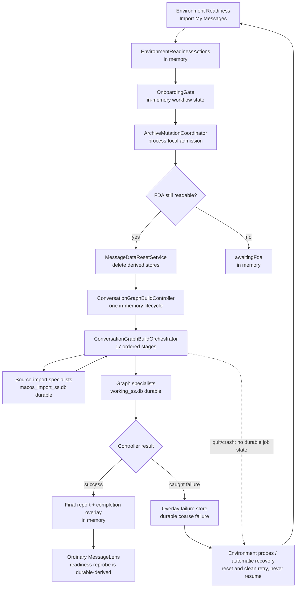

# Initial Import And Graph-Build Lifecycle Audit

## Executive Finding

The initial setup operation is not two independently managed operations called
"import" and "graph build." The production button starts one
`OnboardingGate` action admitted as `onboardingImport`. That action deletes the
derived import and graph stores, then awaits one
`ConversationGraphBuildController.runOnce()` lifecycle. The controller runs 17
ordered source-import and graph-projection stages.

The operation layer currently exposes only coarse live truth: idle, running,
succeeded, or failed, plus start and finish times. Exact stage names and stage
timings exist only inside the orchestrator and become consumable only in the
final successful report. There is no percentage, live stage event, durable job
checkpoint, resume point, or cancellation signal.

> **The first production defect is that `Abort Import` promises cancellation
> that does not exist. The smallest truthful next implementation is to remove
> that affordance until a real cancellation contract has been designed and
> implemented.**

A calm, indeterminate "MessageLens is building local browsing data" experience
is supportable from current facts. A truthful stage-by-stage experience is not.

## 1. Exact Production Execution Path

### Human action to admitted operation

```text
EnvironmentReadinessPanelView
    EnvironmentReadinessActionKind.startImport
    human presses "Import My Messages"
        -> EnvironmentReadinessActions.startImportAndGraphBuild()
        -> OnboardingGate.startImportAndGraphBuild()
```

The button callback does not await the returned `Future`; the provider action
does await the Gate. This does not change ownership, but it means a rejection
that escapes the provider action is not presented by the button itself.

`OnboardingGate.startImportAndGraphBuild()` performs the first guard:

1. If the Gate is not `awaitingUserAction`, return without starting work.
2. Request `ArchiveMutationCoordinator.run()` with:
   - operation: `ArchiveMutationOperation.onboardingImport`;
   - owner: `onboarding-first-run`;
   - action: `_startImportAndGraphBuild`.
3. The coordinator obtains the admitted archive identity and one process-local,
   exclusive mutation owner.
4. `onboardingImport` does not currently require a verified production
   checkpoint and does not mark database reopen as blocked.

Only after mutation admission does `_startImportAndGraphBuild()` recheck Full
Disk Access. If `chat.db` is no longer readable, it changes the Gate to
`awaitingFda` and returns before reset or build mutation.

### Destructive preparation

`OnboardingGate._prepareForFreshStartIfNeeded()` always invokes
`MessageDataResetService.resetDerivedData()`.

The report changes only the explanatory log path. Whether automatic recovery
was previously indicated or not, the service:

1. requests `ArchiveMutationOperation.messageDataReset`;
2. re-enters the already-held async-Zone owner rather than acquiring a second
   independent authority;
3. closes the source-scoped import and Conversation Graph database providers
   when their files exist;
4. deletes the active source-scoped import and Conversation Graph database
   files and sidecars;
5. deletes retired import/working cleanup files;
6. invalidates derived message-data providers;
7. bumps the message-data version;
8. probes that the target files no longer exist;
9. preserves overlay data, preferences, and the attachment archive.

Reset failure is logged and rethrown. It occurs before the Gate's graph-build
`try/catch`, so the Gate does not persist it as a pipeline failure or return
itself to a deliberate failure presentation.

### Presentation staging and real build

After reset, the Gate performs two presentation state changes:

```text
OnboardingStatus.importing
    -> wait for one rendered frame
OnboardingStatus.buildingGraph
    -> wait for one rendered frame
```

No import work runs during the `importing` frame. The real import starts only
after the Gate has changed to `buildingGraph` and calls:

```text
OnboardingGate._runConversationGraphBuild()
    -> ConversationGraphBuildController.runOnce(
         owner: "onboarding-first-run",
       )
```

The controller requests `ArchiveMutationOperation.graphBuild`, but it too
re-enters the Gate's existing Zone owner. It then:

1. changes `ConversationGraphBuildState` to `running`;
2. resolves `ConversationGraphBuildService`;
3. awaits `ConversationGraphBuildOrchestrator.runOnce()`;
4. bumps the message-data version after success;
5. publishes either a successful final report or an error in process memory.

The orchestrator sequentially runs the 17 stages inventoried below.

### Success

On success:

1. the controller publishes `succeeded` with the final report;
2. the Gate clears the persisted graph-projection failure entry;
3. the Gate changes to `OnboardingStatus.complete`;
4. `_CompleteContent` reads the in-memory final report and displays final
   message import, enrichment, and projection metrics;
5. the human presses the completion action;
6. `OnboardingGate.dismiss()` removes the workflow override, selects the
   Messages sidebar, and sets the Gate to `notNeeded`.

### Caught build failure

If any orchestrator/controller error reaches the Gate's build `try/catch`:

1. the controller publishes `failed` with `lastError` in memory;
2. the Gate stores the error in overlay as a **graph projection** failure,
   regardless of which import or projection stage originated it;
3. the Gate clears its workflow override, invalidates the environment report,
   and returns to `awaitingUserAction`.

This is a clean catch boundary around the controller lifecycle only. Archive
admission, FDA recheck, and reset occur outside it.

## 2. Real Operation Boundary

There are two nested descriptions of the work, and both matter:

### Gate-level admitted unit

The smallest unit treated by the first-run caller as one setup action is:

```text
FDA recheck
    + destructive derived-data reset
    + controller build
    + success/failure handoff
```

It is held under one outer `ArchiveMutationOperation.onboardingImport`
admission. Reset and graph-build requests are nested, re-entrant declarations;
they do not establish independent mutation ownership.

### Controller-level build unit

The actual data-construction unit is one
`ConversationGraphBuildController.runOnce()` future:

```text
9 source-import/enrichment/join stages
    + 8 Conversation Graph projection stages
```

Reset is a destructive precondition to that build, not a stage in the
orchestrator or its report. Recovery cleanup is likewise outside the
controller.

Therefore the most exact statement is:

> First-run setup is one Gate-level admitted action containing a destructive
> reset followed by one indivisible, non-cancellable controller build
> lifecycle.

### Mutation-policy caveat

The coordinator preserves the **outer** operation when a nested operation
re-enters. Consequently, nested `messageDataReset` does not elevate the current
coordinator state to the reset operation's stronger policy:

- `onboardingImport.blocksDatabaseReopen` is `false`;
- `messageDataReset.blocksDatabaseReopen` is `true`;
- `onboardingImport.requiresVerifiedCheckpoint` is `false`;
- `messageDataReset.requiresVerifiedCheckpoint` is `true`;
- nested operations skip a second checkpoint check.

The reset service explicitly closes and invalidates its database providers, so
this audit did not establish an observed collision. Nevertheless, the outer
operation is not currently a policy superset of the destructive work it
contains. This is a real admission-model caveat, not a recommendation for a
second implementation slice in this pass.

## 3. Phase Inventory

### Gate and controller phases

| Phase | Owner | Durable mutation | Live progress exposed | Failure boundary | Restart behavior |
| --- | --- | --- | --- | --- | --- |
| Action guard and mutation admission | Environment Readiness, Gate, coordinator | No data mutation | Coordinator exposes only process-local lock state | Admission may throw outside Gate build catch | Re-evaluated from current environment; no operation resumes |
| FDA recheck | Gate | No | Gate can expose `awaitingFda` | Returns without mutation when false | Fresh probe on restart |
| Derived-data reset | `MessageDataResetService` | Deletes import/graph stores and retired files | Logs only; no progress contract | Logs and rethrows outside Gate build catch | Surviving files are probed; reset may be performed again |
| `importing` presentation frame | Gate | No | Yes, as Gate status | No operational work exists in this phase | Ephemeral; lost on restart |
| `buildingGraph` presentation frame | Gate | No | Yes, as Gate status | Precedes controller call | Ephemeral; lost on restart |
| Controller running | `ConversationGraphBuildController` | Through orchestrator | `running`, owner, `startedAt` | Controller catches, records in-memory error, rethrows | Ephemeral; no resume |
| Orchestrator execution | `ConversationGraphBuildOrchestrator` and specialists | Yes | No common live stage seam | First thrown stage error ends build | Partial durable stores are inferred and may be reset |
| Success report | Controller | No additional data build | Final report in memory | N/A | Report and completion overlay are lost; readiness is reprobed |
| Persisted failure handoff | Gate and failure store | Overlay failure entry | Environment report can consume it | Only controller errors reach this path | Durable failure may trigger recovery classification |
| Automatic recovery | Gate and reset service | Deletes derived stores | Coarse `recoveringFailedAttempt` only | Reset error logged; Gate still returns to awaiting action | No durable recovery checkpoint; startup probes again |

### Exact orchestrator stages

Every stage is awaited sequentially. A completed stage may leave durable rows
in `macos_import_ss.db` or `working_ss.db`. There is no cross-stage database
transaction and no operation-wide atomic commit.

| Order | Current stage name | Owner class of work | Durable target | Live common progress | Failure and restart |
| ---: | --- | --- | --- | --- | --- |
| 1 | `import_chats` | source-import specialist | source-scoped import DB | None | Exception ends build; partial import DB remains |
| 2 | `import_handles` | source-import specialist | source-scoped import DB | None | Same |
| 3 | `import_contacts` | source-import specialist | source-scoped import DB | None | Same |
| 4 | `import_messages` | source-import specialist | source-scoped import DB | None | Same; final counts exist only if stage returns |
| 5 | `enrich_missing_text` | message enrichment specialist | source-scoped import DB | None | Same |
| 6 | `import_attachments` | attachment-import specialist | source-scoped import DB and attachment archive activity owned downstream | None | Same; archive facts may outlive failed build |
| 7 | `import_chat_message_joins` | source-import specialist | source-scoped import DB | None | Same |
| 8 | `import_chat_handle_joins` | source-import specialist | source-scoped import DB | None | Same |
| 9 | `import_message_attachment_joins` | source-import specialist | source-scoped import DB | None | Same |
| 10 | `project_handles` | graph specialist | Conversation Graph DB | None | Exception ends build; prior import and graph rows remain |
| 11 | `project_contacts` | graph specialist | Conversation Graph DB | None | Same |
| 12 | `project_chat_handle_edges` | graph specialist | Conversation Graph DB | None | Same |
| 13 | `project_chats` | graph specialist | Conversation Graph DB | None | Same |
| 14 | `project_messages` | graph specialist | Conversation Graph DB | None | Same; final counts exist only if stage returns |
| 15 | `project_attachments` | graph specialist | Conversation Graph DB | None | Same |
| 16 | `project_chat_message_edges` | graph specialist | Conversation Graph DB | None | Same |
| 17 | `project_message_attachment_edges` | graph specialist | Conversation Graph DB | None | Same |

The orchestrator stores a stage's timing only **after** that stage returns. If a
stage throws, its name and partial elapsed time do not appear in a returned
report because no report is returned at all.

## 4. Operational Truth Versus Presentation Fiction

| Presented state | Actual work | Truth assessment | Can current UI know more? |
| --- | --- | --- | --- |
| `awaitingUserAction` / Import My Messages | No mutation yet | Literal | It has environment and accepted-readiness facts |
| `importing` | Reset has finished; Gate is waiting one frame before changing state | Misleading as an operational phase; no importer is running | No live stage exists yet, but the Gate knows this is only staging |
| `buildingGraph` | After a second frame, all 17 import and projection stages run under one controller | Coarse; literally wrong for the first nine stages if read as graph projection only | It can know only that the controller is running |
| `Preparing setup...` | Controller is still idle during the two staging frames | Coarse but truthful | No stage data is available |
| `Building browsing data...` | Controller is running source import and/or graph projection | Truthful coarse umbrella | Not without an operation-layer live stage seam |
| `Browsing data ready` | Controller succeeded in this process | Literal at that moment | Final report and counts are available |
| `Import Complete!` | Controller returned and final report exists | Semantically understandable, but narrower than the actual import-plus-projection result | Final report can support a more exact completion account |
| Controller error text | A stage or controller dependency threw | Error itself is truthful; failure is persisted under the coarse graph-projection category | Failed stage identity is not available from the common API |

The current overlay wisely renders `importing` and `buildingGraph` through the
same progress content. Its visible "Building browsing data" wording is more
truthful than the underlying two-state enum.

## 5. Progress Information Inventory

| Information | Availability | Durability | Current usefulness |
| --- | --- | --- | --- |
| Controller `idle/running/succeeded/failed` | Live and UI-consumable | Ephemeral | Supports indeterminate activity and terminal state |
| Controller owner | Live and UI-consumable | Ephemeral | Diagnostic, not human progress |
| Controller `startedAt` | Live and UI-consumable | Ephemeral | Could support elapsed time during this process |
| Controller `finishedAt` | Available at terminal state | Ephemeral | Diagnostic/completion timing |
| Controller `lastError` | Available after caught controller failure | Ephemeral; separately copied coarsely to overlay | Supports failure display |
| Orchestrator current stage | Not published | Ephemeral local call stack only | Cannot drive production UI |
| Completed stage names | Collected internally; returned only after success | Ephemeral | Completion diagnostics only |
| Stage start/end timestamps | Collected internally; returned only after success | Ephemeral | Completion diagnostics only |
| Message import, enrichment, projection results | Returned only after success | Ephemeral | Final summary only |
| Percent complete | Does not exist | N/A | Unsupported; stage count would not be a truthful work percentage |
| Per-stage row totals while running | Specialist-specific at most; no shared stream | Mostly ephemeral | Not consumable by the current UI contract |
| Import batch rows | Written by individual importers | Durable | Proves a specialist began a batch and gives source provenance; not operation completion |
| Logs | Some stages/specialists log details | Durable only according to log sink/retention, not workflow state | Diagnostics; not a typed UI contract |
| Persisted failure entry | Available after Gate catches controller error | Durable in overlay | Supports next-launch failure/recovery inference |
| Database/file/readiness probes | Available on demand | Derived from durable files | Supports restart classification, not live progress |

`import_batches.started_at_utc` is inserted by individual importers. The schema
also has `finished_at_utc` and `notes`, but the current ledger API does not mark
the batch complete. A batch row therefore cannot be treated as a durable stage
checkpoint or proof that its importer finished.

### Can the UI show live stage names today?

No. Production UI cannot truthfully say "Importing messages," "Importing
attachments," or "Building conversations" from the current shared API. It
would have to guess from time or inspect implementation internals.

The missing seam is a live, typed stage observation published by the operation
layer when the orchestrator enters and exits a named stage. It would need to be
owned by the controller/orchestrator lifecycle, not reconstructed by
presentation. Such a seam is **not** implemented or recommended as the first
slice by this audit.

## 6. Current `Abort Import` Behavior

The button invokes:

```text
OnboardingOverlayActions.abortImport()
    -> OnboardingGate.abortImport()
    -> MessageDataResetService.resetDerivedData()
```

It does **not**:

- signal the controller;
- clear or complete `ConversationGraphBuildController._inFlight`;
- interrupt the orchestrator;
- ask a specialist to stop;
- await a safe stage boundary;
- persist cancellation intent.

While the build is active, the Gate's original `onboarding-first-run` owner
still holds mutation authority. The button callback starts in a different
async Zone, so reset requests a different owner. The coordinator denies that
request rather than allowing destructive cleanup to race the active build.

That denial is the correct safety behavior, but it means the button does not
abort and does not reset. The active operation continues. The callback itself
does not await the action, and this path has no user-facing handling for the
denial.

If reset ever ran after the build was no longer active, it would delete derived
data and schedule `awaitingUserAction`; that is cleanup, not cancellation. In
normal presentation, however, the button exists only while the operation is
active, which is precisely when its cleanup is denied.

If the process exits during this interaction, there is no durable abort intent.
Startup sees only whatever database files, readiness facts, and persisted
failure entry survived.

> `Abort Import` is materially misleading. It offers no real cancellation and
> normally cannot perform its fallback cleanup while the work is running.

## 7. Failure Semantics

### Caught controller/orchestrator failure

- **Origin:** service resolution, any of the 17 stages, post-build data-version
  handling, or another controller-awaited dependency.
- **Catch:** controller records an in-memory failed state and rethrows; Gate
  catches around `_runConversationGraphBuild()`.
- **Persisted state:** Gate writes one graph-projection failure entry to overlay.
- **Partial output:** completed importer transactions, batch rows, graph rows,
  and attachment archive effects may remain.
- **Next launch:** environment probes combine the failure entry with import and
  graph state. A sufficiently populated import store plus clearly incomplete
  graph may trigger automatic reset; otherwise the failure is surfaced while
  derived facts remain.
- **Retry:** clean rebuild after reset, not resume from the failed stage.

An import-stage error is currently persisted as graph-projection failure. The
human receives a failure, but phase classification is not exact.

### Reset or admission failure

- **Origin:** mutation admission/checkpoint policy, database close/delete, file
  verification, or another reset dependency.
- **Catch:** reset logs and rethrows; first-run Gate has no encompassing catch.
- **Persisted state:** no pipeline failure is written by this path.
- **Partial output:** reset may have deleted one store or sidecar before failing.
- **Next launch:** reconstruction relies on probes and heuristics.

### Abrupt process termination

- **Origin:** quit, crash, kill, host shutdown.
- **Catch:** none.
- **Persisted state:** no job/cancellation/failure record is added.
- **Partial output:** all transactions committed before termination survive;
  active SQLite transactions should roll back, but the multi-stage operation is
  not atomic.
- **Next launch:** no resume. Environment classification is derived from files,
  row counts, graph readiness, and any older failure entry.

### Permission failure during operation

Full Disk Access is checked before reset, but no common mid-operation permission
monitor exists. A later source read failure is an ordinary specialist exception
and follows the caught build-failure path. It is not reclassified as
`awaitingFda` by the Gate.

### Corrupt or partial stores

The environment evaluator checks file readability, message row counts, and a
minimum graph readiness shape. It can identify some clearly incomplete graph
states, especially when the import ledger substantially tracks the source and
the graph has far fewer messages. It cannot prove full stage completion or
operation provenance. Retry is a reset and rebuild, not a continuation.

## 8. Restart Semantics

No row records "initial setup is running" or "current stage is X." Gate,
controller, coordinator, report, and automatic-recovery-in-flight state are all
process-local.

| Exit point | Durable authority/evidence | Reconstructed on launch | Resume? | Reset/restart behavior | Human result |
| --- | --- | --- | --- | --- | --- |
| Before reset | Presence accepted-readiness completion; existing environment files | Environment report and Gate | No operation to resume | Human may start import | Import opportunity returns if facts still allow it |
| During reset | Partially deleted files; no reset checkpoint | File and DB probes | No | May classify ready-to-import or later trigger cleanup from partial facts | Setup action or recovery presentation |
| After reset, before build | Import/graph stores absent | Ready-to-import environment | No | Human starts a fresh run | Import opportunity returns |
| During source import | Batch/source rows committed by completed specialists; graph absent or partial | Counts, files, readiness, failure store if one pre-existed | No | Strongly incomplete state may auto-reset; otherwise failure/ready-to-import classification | Recovery or retry, never stage resume |
| During graph projection | Populated import DB plus partial graph DB | Import count and graph readiness | No | Usually classified graph failure; automatic reset requires the evaluator's threshold evidence | Recovery or retry |
| After build success, before completion UI | Populated import DB and graph that passes readiness | Environment state `ready`; no final report | No need to rerun | No cleanup | Ordinary app can open; completion summary is skipped |
| After caught failure | Partial stores plus durable overlay failure | Failure and environment report | No | Automatic reset when recovery heuristic is satisfied; otherwise retry remains a fresh build | Failure/retry or recovering state |
| During recovery cleanup | Partially deleted files; no recovery checkpoint | File and DB probes | No | Cleanup may effectively be retried or state may become ready-to-import | Awaiting import after reconstruction |

One important limit: automatic recovery is deliberately conservative. It
requires a populated import store above a minimum size that plausibly tracks
the source and a clearly incomplete graph. A missing graph without those facts
does not, by itself, prove an interrupted operation.

## 9. Durable Evidence Inventory

| Durable artifact | What it can prove | What it cannot prove |
| --- | --- | --- |
| Completed required-sources Presence Schedule run | The readiness workflow was accepted/completed | Import start, progress, success, or failure |
| `macos_import_ss.db` existence and message count | Some source-scoped imported facts survived; count can be compared with source | Which full build created them; current stage; all import tables complete |
| `import_batches` rows | A particular importer allocated a batch for a source at a time | Batch completion; operation completion; ordered global stage checkpoint |
| Source facts with `batch_id` | Provenance to an importer batch/source | Completion of later imports or projection |
| `working_ss.db` existence and row counts | Some graph projection survived | Complete and current graph without additional readiness checks |
| Conversation Graph readiness probe | Required tables exist and messages, chats, and chat-message edges are nonempty | All 17 stages completed; parity with source; freshness; attachment/contact completeness |
| SQLite schema/version metadata | Store shape is compatible with current code | Import/build completion or data completeness |
| Overlay onboarding failure entry | A prior Gate-caught controller run failed and when it was recorded | Exact failed stage; abrupt termination; reset failure; reliable import-vs-projection phase |
| Filesystem existence, size, timestamps | Physical artifacts exist and changed | Logical completion or ownership of the change |
| Attachment archive files | Individual payloads were archived | Completion of the corresponding source-import or graph build |

Current derived-state probing is sufficient to fail closed into rebuild/retry
for many partial states and to recognize a minimally usable graph. It is not a
durable job-state model and cannot resume work or explain exactly where an
interrupted run stopped.

This audit does not find a durable job record immediately necessary for the
smallest truthful UI. It would become necessary if requirements add resume,
durable cancellation, exact interruption reconciliation, or a guaranteed
post-restart operation narrative.

## 10. Smallest Honest User-Facing Narrative

Current operation facts can support:

```text
Preparing MessageLens
    -> Building local browsing data
    -> Browsing data is ready
```

The application can also truthfully say:

- work is active;
- when this process's build began;
- that the user should keep MessageLens open;
- that success produced final import/enrichment/projection counts;
- that a caught build failed and a retry will rebuild rather than resume.

It cannot currently support:

- the exact active stage;
- a meaningful percentage;
- rows remaining;
- time remaining;
- "resuming where you left off";
- "cancelling safely";
- exact source-import versus graph-projection failure classification.

The two hidden Gate statuses should not be treated as evidence for a more
detailed narrative. `importing` is one presentation frame; `buildingGraph`
covers the entire real controller run.

## 11. The "I've Got You" Requirement

| Candidate reassurance | Classification | Reason |
| --- | --- | --- |
| Indeterminate activity indicator | Supported | Controller exposes a live running state |
| Current stage | Unsupported | No live stage observation leaves the orchestrator |
| Percentage | Unsupported and potentially misleading | No truthful work denominator; stages have unequal cost |
| Elapsed time | Supported within the current process | Controller exposes `startedAt`; UI does not currently render it |
| Estimated time remaining | Unsupported | No estimate model or stable denominator |
| Explanation of what is happening | Supported at coarse level | One controller builds local browsing data |
| Explain what is safe to do | Partly supported | It is truthful to ask the user to keep MessageLens open; durable resume is absent |
| Warning not to quit | Supported and warranted | Quitting loses in-memory operation state and causes probe-based retry/recovery |
| "You can leave this running" | Supported only if MessageLens remains open | Backgrounding another macOS app does not create durable resume semantics |
| Cancel/Abort | Actively misleading | No cancellation signal exists; cleanup is denied during the active operation |
| Retry after failure | Supported | Gate/environment recovery leads to a clean rebuild, not resume |

Calmness does not require invented precision. The current operation can support
a quiet activity state, a clear request to keep the app open, and an honest
completion or retry outcome.

## 12. Abort Verdict

> **A real cancellation mechanism is required before offering Abort.**

The existing control neither signals nor stops the controller. Its attempted
reset is correctly denied by mutation exclusion while the controller remains
active. Relabeling the same action would not make it useful: it has no safe,
available behavior during the interval in which it is shown.

## 13. Exactly One Next Implementation Slice

```text
Next concern:
Remove the false cancellation contract from first-run progress.

Why it comes next:
The control promises a destructive operational transition that the operation
layer cannot perform. Correcting that false promise is more urgent than adding
finer progress detail.

Current defect:
"Abort Import" sends no cancellation signal, does not stop the controller, and
normally has its cleanup reset denied by the active mutation owner.

Smallest implementation:
Remove the first-run Abort Import affordance and its presentation-only action
path. Leave the active build, reset, failure, recovery, and restart mechanics
unchanged. Do not substitute another stop/cleanup command.

Owner:
Onboarding presentation and its narrow overlay action seam.

Persistence impact:
None.

Restart impact:
None. Existing probe-based restart and recovery remain unchanged.

Presentation impact:
The progress surface becomes honestly non-cancellable. Existing indeterminate
activity and coarse status remain.

Test seam:
Progress presentation proves no Abort control is offered during first-run or
reimport, while controller execution and failure/recovery tests remain
unchanged.
```

This recommendation intentionally does not add cancellation or stage telemetry.
Those would be separate operational designs.

## 14. Generic Operation-Step Verdict

> **Generic operation Step still NOT earned.**

`OpenFdaSettingsStep` and initial data construction share only the vague fact
that they cause work:

| Contract dimension | FDA Settings opening | Initial reset/build |
| --- | --- | --- |
| Start | Immediate external-settings request | Human action plus archive mutation admission |
| Awaited completion | Opening request returns; permission truth verified later by a Test Step | One long controller future returns only after all stages |
| Mutation | External system presentation; no archive build mutation | Deletes and rebuilds derived archive stores |
| Progress | No long-running progress contract | Coarse in-memory running state |
| Restart | Fresh FDA test determines truth | File/readiness probes choose ready, retry, or cleanup; no resume |
| Failure | Settings-open failure or later FDA Test result | Exceptions, partial durable stores, coarse persisted failure, recovery |
| Cancellation | Not applicable to the opening request | Required for Abort but absent |
| Result | No permission result from opening; fresh Test supplies truth | Final graph-build report in memory; readiness can be reprobed |

There is no exact shared mechanical contract for start, completion, mutation,
reconciliation, cancellation, and result. A generic operation Step would hide
those differences rather than explain them.

## 15. Presence Versus Operational Ownership

Presence may eventually own the human-facing sequence around this operation:

```text
Tell what will happen
    -> Choice to begin
    -> non-interactive progress presence
    -> Tell success or offer truthful retry after reconciled failure
```

Presence should not own the operation itself.

Operational ownership remains:

- `OnboardingGate`: onboarding transition and recovery policy;
- `ArchiveMutationCoordinator`: admitted mutation exclusion;
- `MessageDataResetService`: destructive derived-data reset;
- `ConversationGraphBuildController`: one in-process build lifecycle;
- orchestrator and specialists: source import and graph projection;
- failure store and environment evaluator: durable evidence and startup
  reconciliation.

Presence must consume derived operational state and submit typed human intent.
It must not reproduce import stages, mutate databases, infer completion from
presentation, or make a Renderer interaction into an archive command.

## 16. Lifecycle Diagram



The arrows through specialists are conceptual ownership transitions; the
orchestrator actually awaits each specialist sequentially. Import and graph
stores are durable. Coordinator, Gate workflow override, controller status,
current stage, report, and completion presentation are not.

## Final Answer

```text
The first production defect in the import/graph-build lifecycle is:
    the UI offers Abort Import even though the operation has no cancellation
    seam and mutation exclusion denies its attempted cleanup while work runs.

The smallest truthful next implementation is:
    remove the Abort affordance and leave the operation explicitly
    non-cancellable until real cancellation semantics are designed.
```

Current operation facts are sufficient for a calm, coarse, indeterminate
progress experience. One operation-observability seam would be required before
the UI could truthfully name live import/projection stages, but that seam does
not come before correcting the false cancellation promise.
