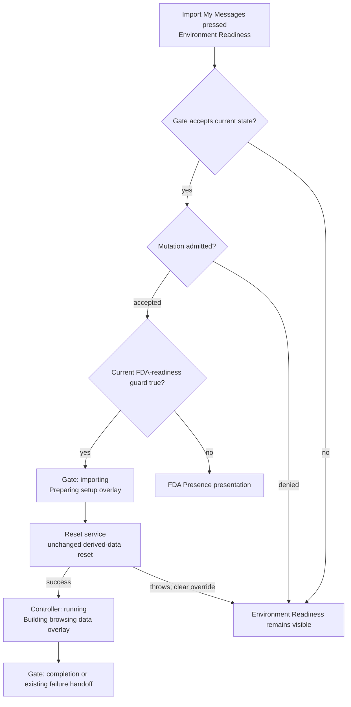

# Pre-Overlay Import-Start Acknowledgement Audit

## Executive Answer

The meaningful visible gap is the destructive derived-data reset. The human
presses **Import My Messages**, but `OnboardingGate` remains
`awaitingUserAction` through mutation admission, its current FDA-readiness
lookup, and the complete reset. The readiness surface and its still-enabled
button therefore remain visible while app database providers close and derived
files are deleted.

The smallest truthful correction is to reuse the existing full progress
overlay:

> **Immediately after the operation is admitted and the current FDA-readiness
> guard passes, the visible response should be _Preparing setup…_, owned by
> `OnboardingGate`, and it can appear before derived-data reset without
> misrepresenting the operation.**

No new state, progress component, telemetry, persistence, or command authority
is needed. The existing `OnboardingStatus.importing` workflow override is
already rendered as a blocking preparation surface when the graph controller
is idle. It is merely published after reset instead of before it.

The future implementation must make two narrow supporting guarantees:

1. the preparation headline must come from the Gate's preparation status, not
   from stale terminal controller state left by an earlier attempt;
2. if reset throws, the Gate must remove the ephemeral preparation override
   and return to the existing readiness surface before preserving the current
   thrown-error behavior.

This audit does not redesign reset failure reporting.

## 1. Exact Current Gap

### Current event flow

| Sequence | Current owner and action | Visible acknowledgement |
| ---: | --- | --- |
| 1 | `EnvironmentReadinessPanelView` invokes `EnvironmentReadinessActions.startImportAndGraphBuild()` from a non-`async` button callback. | Ordinary native pressed feedback only. |
| 2 | `EnvironmentReadinessActions` awaits `OnboardingGate.startImportAndGraphBuild()`. | None. The panel does not watch the action provider and no in-flight state is published. |
| 3 | The Gate returns unless its current state is `awaitingUserAction`. | None. |
| 4 | `ArchiveMutationCoordinator.run()` synchronously attempts to acquire `onboardingImport` authority for `onboarding-first-run`. | None. The readiness panel remains active. |
| 5 | The admitted Gate action reads `onboardingFullDiskAccessProvider`. | None when true. When false, the Gate changes to `awaitingFda` and the FDA Presence presentation takes over. |
| 6 | `_prepareForFreshStartIfNeeded()` always invokes `MessageDataResetService.resetDerivedData()`. | None. The readiness surface and enabled import action still appear unchanged. |
| 7 | Reset closes database providers, deletes active derived stores and sidecars, deletes retired cleanup files, invalidates providers, bumps the data version, and probes file absence. | None. This is the meaningful logical and potentially wall-clock gap. |
| 8 | Only after reset returns does the Gate set `OnboardingStatus.importing`. | The shell replaces Presence/readiness with the blocking `OnboardingOverlay`. |
| 9 | The Gate waits for one painted frame. | The first progress frame normally says **Preparing setup…** with an indeterminate indicator and keep-open guidance. |
| 10 | The Gate sets `buildingGraph`, waits another frame, and calls the controller. | The same overlay remains. Once the controller reports `running`, it says **Building browsing data…**. |

### What can look like nothing happened?

The UI can look unchanged throughout:

```text
Gate eligibility check
    -> mutation admission
    -> current FDA-readiness lookup
    -> complete derived-data reset
```

Admission and the FDA lookup are normally short. Reset performs real
asynchronous work and is the user-significant gap. The controller has not yet
started during any of it.

## 2. What Is True After The Click

### Safe to tell the human

After the Gate guard, mutation admission, and FDA-readiness guard have
succeeded:

- MessageLens accepted this setup attempt;
- one process-local archive mutation owner is active;
- setup preparation has begun;
- derived browsing data is about to be reset and reconstructed;
- MessageLens must remain open for the process-local operation;
- using other applications does not interrupt it;
- the graph-build controller has not started yet.

Therefore these existing statements are truthful:

```text
Preparing setup…

Keep MessageLens open while it prepares your messages.
You can use other apps in the meantime.
```

### Too internal for primary presentation

- mutation admission and owner labels;
- async-Zone re-entry;
- checkpoint policy;
- FDA provider identity;
- provider closing and invalidation;
- database filenames and sidecars;
- retired cleanup files;
- message-data version changes.

### Not yet true

- messages are being imported;
- conversations are being projected;
- the controller is running;
- a particular stage is active;
- a percentage is complete;
- the operation can resume after quit or restart.

## 3. Current Button And In-Flight Behavior

The **Import My Messages** button has no durable or ephemeral in-flight model:

- `onPressed` calls the action and discards its returned `Future`;
- the action provider awaits the Gate but does not assign `AsyncLoading` or
  another state;
- the panel reads only the action notifier and does not watch the provider;
- the button is not disabled after press;
- its label and child do not change;
- no local spinner or acknowledgement appears;
- thrown action errors have no button-owned presentation.

### Repeated clicks

Correctness does not depend on the button. While the Gate remains
`awaitingUserAction`, a second call can pass the Gate guard. The coordinator's
exclusive owner then rejects that call with `ArchiveMutationDeniedException`.
The first operation continues; two resets or builds do not start.

The rejected `Future` propagates through `EnvironmentReadinessActions`, while
the non-`async` button callback does not observe it. The coordinator records
the denied request diagnostically, but the readiness surface provides no
stable human response.

Once the Gate publishes a preparation status earlier, ordinary later clicks
will also fail the Gate status guard. The coordinator must remain the actual
cross-operation exclusion authority.

## 4. Three User-Facing Periods

| Period | Truth | Required presentation |
| --- | --- | --- |
| A. Accepted preparation | The operation is admitted, source readiness has passed the current guard, and reset is pending or active. The controller is idle. | One coarse **Preparing setup…** state is sufficient. |
| B. Controller build | The controller is `running` across source import and graph projection. | Existing **Building browsing data…** progress. |
| C. Terminal result | The controller succeeded or the current failure path took over. | Existing completion and failure/recovery presentations. |

Period A does not justify separate human phases for permission checking,
locking, provider closure, file deletion, or invalidation. Those distinctions
do not change what the human should understand or do.

## 5. Pre-Controller Failure Boundaries

### Mutation admission denied

The coordinator throws `ArchiveMutationDeniedException` before invoking the
Gate action. No Gate workflow status changes, so the readiness surface remains
visible and the action remains available. The error propagates through an
unobserved button `Future`.

An earlier full overlay should not appear for this case: the operation was not
admitted. This audit does not redesign denial presentation.

### FDA readiness is false

Inside the admitted action, a false `onboardingFullDiskAccessProvider` value
sets the Gate to `awaitingFda` and returns before reset. The coordinator then
releases its owner. The FDA-specific Presence surface becomes effective.

The preparation overlay should therefore begin **after** this guard. That
avoids showing preparation only to replace it immediately with an actionable
FDA presentation.

#### Accuracy correction

Current comments and earlier audits call this a recheck, but current code does
not invalidate the keep-alive `onboardingFullDiskAccessProvider` here. The
provider was computed by calling the read-only Messages probe and the Gate now
reads its cached Boolean value. It is a readiness guard against the most
recently computed fact, not a guaranteed fresh source probe.

If that cached value is false, FDA presentation works as described. If it is
stale true after permission was revoked, this guard does not discover the
revocation; later source access may fail after reset. That is an existing,
separate correctness concern. FDA behavior is explicitly outside this audit's
recommended slice.

### Reset throws

`MessageDataResetService` logs the failure and rethrows. It may have already
closed providers or deleted some files. The exception is outside the Gate's
controller-build `try/catch`, so:

- no pipeline failure is persisted;
- no deliberate failure presentation is selected;
- the Gate currently remains `awaitingUserAction` because no workflow override
  has yet been set;
- the readiness panel remains visible;
- the returned `Future` rejects without button-owned presentation;
- a later retry is possible, subject to fresh environment/file inference.

If preparation becomes visible before reset, the future implementation must
clear that ephemeral override when reset throws. Otherwise the new overlay
would become permanently misleading. The smallest unwind is to restore the
existing readiness state and rethrow; durable failure classification is a
separate concern.

## 6. Ownership Analysis

### Button-local in-flight state

**Strengths**

- can react directly to the gesture;
- can disable the button and show inline activity;
- can clear when the action `Future` completes.

**Weaknesses**

- creates a presentation-local mirror of Gate operation state;
- does not know whether admission succeeded, FDA blocked, or reset began;
- requires the panel to start watching an otherwise command-only provider;
- can disappear with panel lifecycle or provider disposal;
- leaves the rest of the readiness surface interactive;
- duplicates a full blocking progress presentation that already exists.

This is not the preferred owner.

### `OnboardingGate`

The Gate already owns:

- the first-run command guard;
- mutation-admitted setup sequencing;
- source-readiness handoff;
- reset invocation;
- active progress statuses;
- controller execution;
- completion and failure handoff.

Its existing `importing` workflow override is preserved across report rebuilds
and causes the shell to show the blocking overlay. Publishing that state before
reset is the smallest authoritative acknowledgement.

This is the recommended owner.

### Separate application command state

No missing authority requires another provider or state object. A separate
command state would duplicate Gate truth and introduce reconciliation rules
without adding a fact the Gate lacks.

## 7. Can The Existing Overlay Start Earlier?

Yes, after the current FDA-readiness guard and before reset.

The overlay can already render while the controller is idle. In that state it
uses:

```text
Preparing setup…
indeterminate progress
keep-open / use-other-apps guidance
```

All three remain truthful while derived data is being closed, deleted,
invalidated, and prepared for reconstruction. The overlay has no functional
dependency on controller startup; it merely watches controller state to choose
its headline and indicator completion value.

### One stale-state constraint

The graph-build controller is keep-alive and can retain `failed` or `succeeded`
from an earlier attempt. `_ProgressContent` currently derives its headline
entirely from that controller state. If the Gate starts the overlay before a
new reset, a retry could therefore display an old error or **Browsing data
ready** while preparation is active.

The implementation slice must make Gate preparation status authoritative for
the **Preparing setup…** headline. Controller truth should resume authority
when the Gate reaches the controller-running period. This is not new telemetry;
it prevents stale terminal state from misdescribing a new attempt.

### Why the current state is late

The code orders reset before `OnboardingStatus.importing`, then deliberately
waits for a painted progress frame before controller startup. Comments explain
the frame wait, not why reset must remain invisible. Blame history shows reset
and status staging were added at different times. No current test or operation
contract requires reset to precede the preparation presentation.

Automatic recovery already demonstrates the opposite valid pattern: the Gate
publishes `recoveringFailedAttempt` before it requests admitted reset work and
clears that override on denial or completion. There is no architectural reason
the first-run preparation surface cannot truthfully cover reset as well.

## 8. Double-Start Safety

Current protection is layered:

1. the Gate status guard rejects starts after the Gate leaves
   `awaitingUserAction`;
2. while it has not left that state, `ArchiveMutationCoordinator` rejects any
   second owner;
3. once reached, `ConversationGraphBuildController.runOnce()` returns its
   existing in-flight `Future` rather than starting a second controller run.

Today the coordinator carries the important pre-status interval. Moving the
Gate status before reset shortens that interval and disables the visible
action through page replacement, but it must not replace coordinator
exclusion.

No additional lock is warranted.

## 9. Presentation Options

| Option | Truthfulness and continuity | Failure unwind | Ownership and complexity | Verdict |
| --- | --- | --- | --- | --- |
| A. Disable button plus inline activity | Can truthfully say a command is in flight, but leaves a now-stale readiness surface visible and duplicates the later overlay. | Local `Future` completion can clear it, but panel/provider lifecycle must be coordinated. | Adds feature-presentation command state that mirrors the Gate. | Rejected. |
| B. Show existing full progress overlay earlier | **Preparing setup…** and indeterminate activity truthfully cover reset; the same surface naturally continues into controller work. | Must restore readiness on reset throw and yield immediately to FDA when the guard is false. | Reuses Gate state and existing blocking presentation. | **Recommended.** |
| C. Show a separate acknowledgement, then overlay | Can be truthful but creates a second transition and new copy without a distinct human decision. | Requires its own unwind and handoff. | More concepts for less continuity. | Rejected. |

## 10. Keep-Open Guidance Timing

The current statement is truthful during reset:

> Keep MessageLens open while it prepares your messages. You can use other apps
> in the meantime.

Reset and controller execution are process-local. Closing the last window or
quitting ends the process; using another application does not. “Prepares your
messages” is a deliberately coarse umbrella for deleting stale derived data
and rebuilding it.

No narrower preparation paragraph is needed.

## 11. Reimport, Reset, And Recovery Comparison

### Direct `startReimport()`

The same ordering problem exists: reset completes while the Gate remains
`notNeeded`, then `reimporting` makes the overlay visible. This API has no
production caller in `lib/`. It should not be included automatically in the
first-run implementation slice, but any later activation should apply the same
principle.

### Production Reset Message Data

After the human confirms **Proceed**, `confirmResetAndPrepareReimport()` runs
reset without an active-progress surface, then shows **MessageLens Databases
Cleared** and returns to the ordinary import journey. This is another visible
gap, but it has a separate confirmation/completion-dialog contract. It is not
part of the recommended first-run slice.

### Automatic recovery

Automatic recovery already publishes `recoveringFailedAttempt` before reset.
It catches admission denial, catches reset errors, clears its workflow
override, invalidates the report, and returns to `awaitingUserAction`. It is
the closest existing precedent for truthful Gate-owned pre-reset presentation.

## 12. Persistence And Restart

Earlier acknowledgement requires no durable state.

`importing` is process-local presentation of an active process-local operation.
If the app exits during admission or reset, no operation can resume. On the
next launch, existing file and environment probes infer whether derived stores
are absent or incomplete and the existing automatic-recovery/readiness paths
take over.

Persisting “preparing” would falsely imply a resumable job and could resurrect
an activity state after no operation exists.

## 13. Exactly One Recommended Slice

```text
Next concern:
    Acknowledge admitted first-run setup before destructive reset.

Why it comes next:
    Reset is real work during which the current UI still looks idle.

Current defect:
    OnboardingStatus.importing is published only after reset returns.

Smallest implementation:
    After mutation admission and the current FDA-readiness guard succeed,
    publish the existing importing workflow override, render one preparation
    frame, then run the unchanged reset and controller sequence. Make the
    importing status authoritative for the preparation headline so stale
    controller terminal state cannot mislabel the new attempt. If reset throws,
    clear the ephemeral override, restore the existing readiness state, and
    preserve the thrown error.

Owner:
    OnboardingGate.

Gate changes:
    Move the existing importing transition from after reset to before reset;
    add only the failure unwind required by that earlier visibility.

Operation-layer changes:
    None. Admission, FDA behavior, reset, controller, and mutation policy remain
    unchanged.

Persistence impact:
    None.

Failure-unwind behavior:
    Admission denial never shows the overlay. FDA false continues to select the
    FDA presentation. Reset failure removes preparation presentation and returns
    to the existing readiness surface before the Future remains failed.

Presentation impact:
    The existing full overlay appears during reset. No new component or copy.

Test seam:
    A Gate widget test with a reset completer proves importing/preparation is
    visible while reset is pending and the controller has not started. Focused
    cases prove FDA false never enters preparation, reset failure unwinds,
    repeated starts do not duplicate work, and stale controller terminal state
    cannot replace the preparation headline.
```

This slice does not redesign reset failure reporting, fix the cached FDA guard,
extend direct reimport, or solve the nested mutation-policy caveat.

## 14. Transition Diagram



### Current versus proposed visibility

```text
Current:
    admission -> FDA guard -> reset
        visible: unchanged readiness surface
    importing -> controller
        visible: progress overlay

Proposed:
    admission -> FDA guard
        visible: readiness surface; no operation claimed before acceptance
    importing -> reset -> controller
        visible: one continuous progress overlay
```

## Audit Conclusion

The existing **Preparing setup…** surface can start earlier. Admission and the
current FDA-readiness guard should remain ahead of it; reset should not. This
places acknowledgement at the first authoritative, user-significant boundary
without creating another loading state or pretending that controller work has
already begun.
