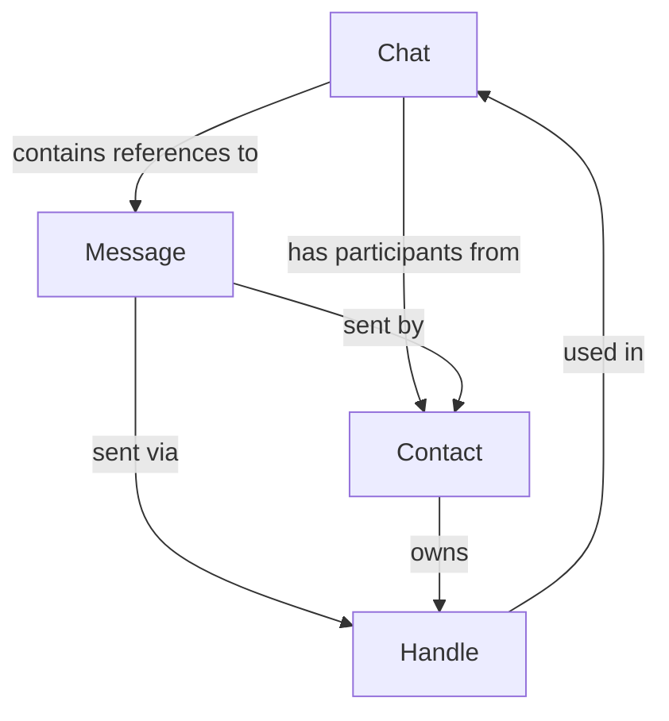

# Phase 1: Domain Contracts

## Status: 🚧 In Progress

**Started**: September 23, 2025  
**Target Completion**: TBD

## Overview

This phase establishes the foundational domain language and contracts for the remember_every_text application. We focus on defining the core aggregates, their boundaries, and the ubiquitous language that will guide all subsequent development.

## Ubiquitous Language

### Core Domain Concepts

**Message Exchange Context**: The fundamental domain revolves around digital message exchange, primarily from Apple's Messages ecosystem, with contact relationship management.

### Key Terms & Definitions

| Term            | Definition                                                   | Domain Significance                                 |
| --------------- | ------------------------------------------------------------ | --------------------------------------------------- |
| **Chat**        | A conversation context containing one or more participants   | Aggregate Root - represents conversational boundary |
| **Message**     | A discrete communication unit within a chat context          | Aggregate Root - represents atomic communication    |
| **Contact**     | A person or entity that can send/receive messages            | Entity - identity and relationship management       |
| **Handle**      | A communication endpoint (phone, email, etc.) for a contact  | Value Object - technical addressing                 |
| **Participant** | A contact's role within a specific chat context              | Value Object - chat-scoped relationship             |
| **Attachment**  | Media or file content associated with a message              | Entity - content with lifecycle                     |
| **Service**     | The communication protocol/platform (iMessage, SMS, etc.)    | Value Object - technical classification             |
| **Thread**      | Synonym for Chat - maintains Apple terminology compatibility | Domain Alias                                        |

### Temporal Concepts

| Term                  | Definition                                  | Technical Notes                             |
| --------------------- | ------------------------------------------- | ------------------------------------------- |
| **Message Timestamp** | When a message was sent/received            | Apple nanoseconds → Unix seconds conversion |
| **Chat Start Date**   | When the first message in chat occurred     | Derived from earliest message               |
| **Chat End Date**     | When the most recent message occurred       | Derived from latest message                 |
| **Import Timestamp**  | When data was last synchronized from source | ETL tracking - not domain concept           |

### Identity & Equality Concepts

| Term                 | Definition                                   | Implementation Strategy                 |
| -------------------- | -------------------------------------------- | --------------------------------------- |
| **Chat Identity**    | Unique identifier for chat aggregate         | GUID from Apple + fallback generation   |
| **Message Identity** | Unique identifier for message aggregate      | Apple message ID + source tracking      |
| **Contact Identity** | Stable identifier for person/entity          | Generated UUID - independent of handles |
| **Handle Identity**  | Unique identifier for communication endpoint | Composite of service + address          |

## Aggregate Boundaries

See also: `02-AGGREGATE_BOUNDARIES.md` for the aggregate roots decision and detailed rationale.

### Chat Aggregate

**Aggregate Root**: `Chat`  
**Boundary Rationale**: Represents the consistency boundary for a conversation context. All operations on messages within a chat should maintain chat-level invariants (participant lists, message ordering, etc.).

**Included Entities**:

- `Chat` (root)
- `ChatParticipant` (value object collection)
- Message references (not full message entities)

**Key Invariants**:

1. A chat must have at least one participant
2. Chat display name must be derivable from participants or explicit
3. Message count and date ranges must be consistent with contained messages
4. Participant list changes are tracked with timestamps

**Boundaries**:

- ✅ **Inside**: Chat metadata, participant management, conversation-level aggregations
- ❌ **Outside**: Individual message content, contact details, attachment data

### Message Aggregate

**Aggregate Root**: `Message`  
**Boundary Rationale**: Messages are independent communication units that can exist across multiple chats (forwarding, references) and have their own lifecycle (delivery, read status, editing).

**Included Entities**:

- `Message` (root)
- `MessageAttachment` (entity collection)
- Contact/Handle references (not full entities)

**Key Invariants**:

1. A message must have either text content or at least one attachment
2. Sender information (handle/contact) must be consistent
3. Timestamp must be valid and within reasonable bounds
4. Message direction (incoming/outgoing) must be deterministic

**Boundaries**:

- ✅ **Inside**: Message content, attachments, delivery metadata, formatting
- ❌ **Outside**: Chat context details, contact management, handle management

### Contact Aggregate

**Aggregate Root**: `Contact`  
**Boundary Rationale**: Contacts represent identity and relationship management, independent of any specific conversation context.

**Included Entities**:

- `Contact` (root)
- `ContactHandle` (entity collection)
- Contact metadata and relationships

**Key Invariants**:

1. A contact must have at least one handle or a display name
2. Handle-to-contact mapping must be unambiguous within service contexts
3. Display name derivation follows consistent priority rules
4. Contact merging/splitting maintains handle consistency

**Boundaries**:

- ✅ **Inside**: Identity management, handle ownership, contact metadata
- ❌ **Outside**: Message content, chat participation tracking, service-specific logic

## Cross-Aggregate Relationships



**Design Principles**:

1. **Eventual Consistency**: Cross-aggregate updates use domain events
2. **Reference by ID**: No direct object references across aggregate boundaries
3. **Bounded Contexts**: Each aggregate maintains its own invariants independently

## Domain Events

### Chat Events

- `ChatCreated` - New conversation started
- `ChatParticipantAdded` - Participant joined conversation
- `ChatParticipantRemoved` - Participant left conversation
- `ChatDisplayNameChanged` - Chat name/title updated

### Message Events

- `MessageReceived` - New message arrived
- `MessageSent` - Message sent successfully
- `MessageDelivered` - Delivery confirmation received
- `MessageRead` - Read receipt received

### Contact Events

- `ContactCreated` - New contact identified
- `ContactMerged` - Duplicate contacts combined
- `ContactHandleAdded` - New communication method added
- `ContactHandleRemoved` - Communication method removed

## Technical Contracts

### ID Generation Strategy

```dart
// Chat IDs: Apple GUID or generated UUID
// Message IDs: Apple message ID with source prefix
// Contact IDs: Generated UUID (stable across imports)
// Handle IDs: Deterministic hash of service + address
```

### Timestamp Strategy

```dart
// All domain timestamps in Unix seconds (int)
// Conversion handled at infrastructure boundaries
// Apple nanoseconds → Unix seconds in ETL layer
```

### Equality & Comparison

```dart
// Entities: Identity-based equality (ID comparison)
// Value Objects: Structural equality (all properties)
// Aggregates: Identity-based with version checking
```

## Validation Rules

### Chat Validation

- GUID format compliance for Apple-sourced chats
- Display name length limits (1-200 characters)
- Participant count limits (1-100 participants)
- Date consistency (start_date ≤ end_date)

### Message Validation

- Content OR attachments required (not both empty)
- Timestamp within reasonable bounds (2000-2100)
- Sender handle must exist in system
- Content length limits (text: 10MB, attachments: per-type)

### Contact Validation

- Display name required if no handles present
- Handle uniqueness within service scope
- Contact merging rules (duplicate detection)
- Name format consistency

## Error Handling Strategy

### Domain Errors

```dart
abstract class DomainError extends Error {
  final String message;
  const DomainError(this.message);
}

class ChatInvariantViolation extends DomainError { ... }
class MessageValidationError extends DomainError { ... }
class ContactIdentityError extends DomainError { ... }
```

### Error Categories

1. **Invariant Violations**: Core business rule breaches
2. **Validation Errors**: Input data format/constraint issues
3. **Identity Conflicts**: Duplicate or inconsistent identity assignments
4. **Temporal Inconsistencies**: Date/time ordering violations

## Next Steps

1. **Review & Approve**: Domain expert review of language and boundaries
2. **Entity Sketches**: Create Freezed entity definitions
3. **Invariant Tests**: Write failing tests for key business rules
4. **Refinement**: Adjust based on real data analysis

---

**Exit Criteria Progress**:

- [x] Ubiquitous language defined
- [ ] Freezed entity sketches compiled
- [ ] Domain invariants expressed as tests
- [ ] ADR document completed

**Files Created**:

- This document (`01-DOMAIN_CONTRACTS.md`)
- Entity sketches (pending)
- Test specifications (pending)
